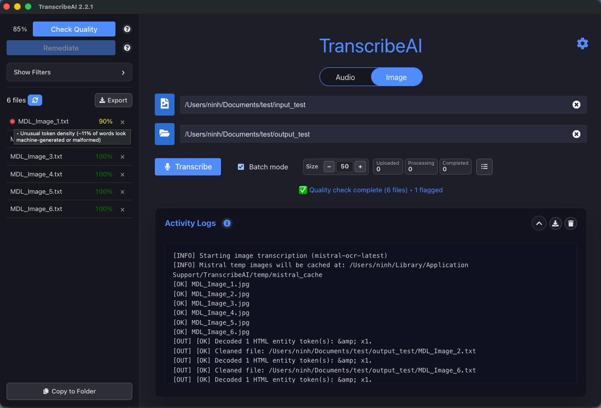

<table align="center">
  <tr>
    <td>
      
    </td>
  </tr>
</table>

**TranscribeAI** helps you turn audio files and image scans into text, fast.

It is designed for people who want a simple setup and need to transcribe many files quickly.

## Stay Tuned

⭐️ Star our repository to stay up-to-date with exciting new features and improvements! Get instant notifications for new releases!

  

**Latest downloads:** [Releases page](https://github.com/Minitex/TranscribeAIUI/releases/latest)

## What You Can Do

- Transcribe **audio files** to text.
- Transcribe **images and PDFs** to text.
- Run a **Quality Check** to flag possible issues.
- Use **Remediate** for safe cleanups (intro/outro chatter, markdown artifacts, encoded entities).
- Get clear warnings for subtitle timestamp issues so you can review those sections manually.
- Track everything in real-time with progress and logs.

## Before You Start

You need at least one API key:

- **Mistral key** (recommended; very fast, great for batch jobs): [Mistral quickstart](https://docs.mistral.ai/getting-started/quickstart)
- **Gemini key** (optional; slightly better image accuracy on many files): [Get Gemini API key](https://ai.google.dev/gemini-api/docs/api-key)

### Gemini vs Mistral (Quick Guide)

- **Mistral**: Very fast, especially when processing large folders in batches. Audio results are also very good.
- **Gemini**: Slightly better image accuracy in many cases, so it is a strong OCR choice when precision matters most.
- Many users add both keys: use Mistral when speed matters and Gemini when image accuracy matters most.

More AI model support is coming soon.

## Install

1. Open the [latest release](https://github.com/Minitex/TranscribeAIUI/releases/latest).
2. Download your installer:
   - macOS: `.dmg`
   - Windows: `.exe`
   - Linux: `.AppImage` or `.tar.gz`
3. Run the installer.

If your system shows a first-run security warning:

- macOS: open Privacy/Security and choose **Open Anyway**
- Windows: choose **More info** then **Run anyway**

## First-Time Setup

1. Open TranscribeAI.
2. Click the **gear icon** (top-right) to open Settings.
3. Paste your API key(s).
4. Click **Save**.

## Basic Use

1. Choose mode: **Audio** or **Image**.
2. Select input file/folder.
3. Select output folder.
4. Click **Transcribe**.
5. Watch progress in the logs.

## Quality Check

- Click **Check Quality** to score your transcript/subtitle files.
- Lower scores mean the app found more potential issues.
- Hover a score to see the penalty breakdown (why it scored lower).
- Red warning dots mean “review needed.”

For subtitle files (`.srt`):

- The app flags timestamp format/order/range issues.
- It shows cue numbers so you can quickly find where to listen and fix.
- Timestamp fixes are **manual review** (not auto-adjusted).

## Updating

- Use the [latest release](https://github.com/Minitex/TranscribeAIUI/releases/latest).
- Install over your current version.
- Your existing settings and data remain.

## License

This project uses the MIT License. See [`LICENSE`](LICENSE).

## Screenshot

<table align="center">
  <tr>
    <td>
      
    </td>
  </tr>
</table>
