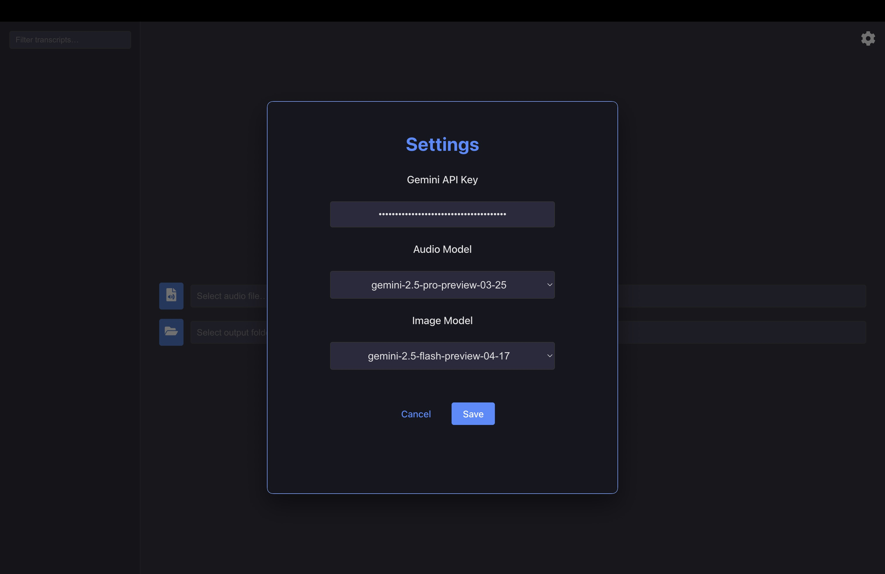

<table align="center">
  <tr>
    <td>
      
    </td>
  </tr>
</table>

**TranscribeAI** is a cross-platform desktop app that uses Large Language Models to transcribe audio files and scanned images/pages. It features:

- **LLM-powered transcription** (e.g. Google Gemini via `google-generativeai`)
- **Resumable image workflows** (skips already-done files, cleans up partial outputs)
- **Real-time logs & progress** in the UI
- **Persistent settings** (stores your API key with `electron-store`)
- **Drag-resizable, searchable sidebar** for managing transcripts

> **Note:** A “headless” version (no UI) is also available and can be integrated into your own system—see  
> https://github.com/Minitex/TranscribeAI  

## Technologies

- **Electron**: Main process for file I/O, spawning Python/CLI binaries, and IPC  
- **React + TypeScript**: Renderer UI, bundled with Vite for fast HMR  
- **Vite**: Modern build tool for instant feedback and optimized production builds  
- **Python CLI**: Native binaries handle image prep & OCR  
- **google-generativeai SDK**: Interfaces with LLMs for high-quality transcription  
- **electron-store**: Simple JSON storage for your Gemini API key

## Setup & Installation

1. **Obtain your Google Gemini API key**
   - Sign in with a Google account that has access to AI Studio.
   - Visit [Google AI Studio API Key Console](https://aistudio.google.com/app/apikey?_gl=1*im4t83*_ga*MTM3ODUyOTU5Ny4xMTM5NDc4MjA0*_ga_P1DBVKWT6V*MTc0NjQ1NDYyNC4xMi4xLjE3NDY0NTQ2MzguNDYuMC4xNjUyODg3NDI) and obtain a key
   - Copy the generated key to your clipboard.

2. **Download TranscribeAI**
   - Go to the [TranscribeAI Releases page](https://github.com/Minitex/TranscribeAI/releases).  
   - Choose the installer for your OS:  
     - **macOS:** `.dmg`  
     - **Windows:** `.exe`  
     - **Linux:** `.AppImage` or `.tar.gz`  
   - Download and run the installer. Because TranscribeAI is an open-source project and we don’t bundle a paid code-signing certificate, you may see a security warning the first time you run it:  
     - **macOS Gatekeeper** (“Unidentified Developer”): open **System Preferences → Security & Privacy**, then click **Open Anyway** next to the TranscribeAI entry.  
     - **Windows SmartScreen** (“Windows protected your PC”): click **More info**, then **Run anyway**.  
   - Follow the installer prompts to complete installation.

3. **Configure your API key**
   - Launch **TranscribeAI**.
   - Click the **gear icon** in the top-right corner to open Settings.
   - Paste your Google Gemini API key into the “API Key” field.
   - Click **Save**.

4. **Run your first transcription**
   - Click the file picker button to select an audio file or image folder, then choose the output folder for your transcripts.
   - Click **Transcribe** to begin transcription.
   - Monitor progress and logs in real time.

## Screenshots

<table align="center">
  <tr>
    <td>
      
    </td>
  </tr>
  <tr>
    <td>
      
    </td>
  </tr>
</table>