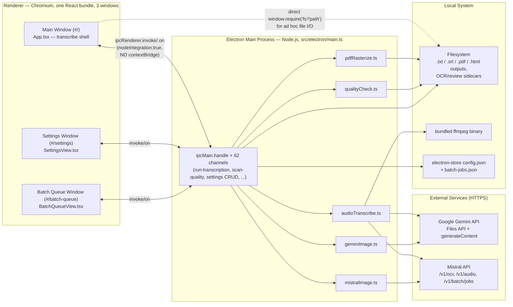

# TranscribeAI — Technical Architecture Deep-Dive

## 1. What TranscribeAI Is

**TranscribeAI** (npm package `TranscribeAI`, current version **4.0.0**, macOS/Windows/Linux desktop app, `appId: edu.umn.transcribeai`) is an Electron + React/TypeScript desktop application that turns audio recordings and scanned images/PDFs into text using AI. It has two modes — **Audio transcription** (interviews, recordings, subtitles) and **Image/OCR transcription** (scanned documents, photographed pages, PDFs) — and routes each job to one of two AI providers: **Google Gemini** (a general vision/audio-capable LLM, prompted with free text) or **Mistral** (a purpose-built OCR API for images/PDFs, plus the Voxtral model for audio transcription, with a cheaper asynchronous batch mode for large jobs). It's built for a single institutional user base (the repo is published under `Minitex/TranscribeAIUI` on GitHub, with `edu.umn.transcribeai` as the bundle ID) doing bulk digitization/transcription work — folders of hundreds of scans or hours of audio — where cost, resumability, and review/remediation tooling for imperfect OCR/ASR output matter as much as raw model quality.

The application has a single main process (`src/electron/main.ts`, ~3,672 lines, no router/module split) and one React SPA bundle (`src/ui`) reused across three separate `BrowserWindow`s. It skips the modern `contextIsolation`/preload-bridge security model in favor of direct `nodeIntegration: true` access to Node/Electron APIs from the renderer — a tradeoff that recurs throughout this document.

---

## 2. Tech Stack at a Glance

| Layer | Technology | Why chosen |
|---|---|---|
| Desktop shell | **Electron** | Cross-platform native app (macOS/Windows/Linux) from one JS/TS codebase; gives filesystem + native-binary access that a pure web app can't have. |
| Renderer UI | **React 18 + TypeScript**, single SPA | Component-driven UI for a data-heavy list/review/settings app; TypeScript for type safety across a ~2,400-line main component. |
| Renderer build | **Vite** | Fast dev server with HMR (`localhost:5123`) and esbuild/Rollup production bundling into `dist-react/`. |
| Main-process build | Dedicated **`tsc --project src/electron/tsconfig.json`** pass | Main process runs under plain Node.js (NodeNext ESM), not a bundler — needs real emitted `.js`, separately from the renderer's `noEmit` type-check pass. |
| IPC | **Electron `ipcMain.handle`/`ipcRenderer.invoke`** (request/response only, no fire-and-forget `.on`/`.reply`) | 62 handlers form the entire renderer↔main contract; picked for a simple async promise-based API surface. |
| Renderer↔Node bridge | Direct `window.require('electron'/'fs'/'path'/'os')` in `src/ui/electron.ts` (**no preload/contextBridge**) | Simplicity: components call `fs`/`ipcRenderer` inline with no bespoke IPC channel needed for every file op; tradeoff discussed at length below. |
| Settings/state persistence | **electron-store** (main process, JSON file in `userData`) + **localStorage** (renderer, redundant fallback) | electron-store for durable, main-process-owned config; localStorage as a synchronous fallback when Electron/IPC isn't available or hasn't hydrated yet. |
| Audio decoding/transcoding | **ffmpeg-static** (bundled ffmpeg binary) | Lets the app transcode/split/probe audio without requiring users to install ffmpeg or manage `PATH`. |
| Image processing | **sharp** (native), macOS `sips` CLI fallback | Resize/re-encode images before sending to Gemini/Mistral (dimension caps, format conversion, JPEG quality ladders). |
| PDF creation | **pdf-lib** | Pure-JS PDF assembly/remediation for the "accessible tagged PDF" export path. |
| PDF parsing/rasterizing | **pdfjs-dist** + **`@napi-rs/canvas`** | Render PDF pages to PNGs for the OCR review-modal preview pane (Mistral OCR reads PDFs natively — this is preview-only). |
| AI providers | **Google Gemini** (`generateContent` REST + Files API) and **Mistral** (OCR API, Voxtral audio, Batch API) | Two providers cover different needs: Gemini is a flexible, instructable general vision/audio LLM; Mistral OCR is a cheaper, purpose-built document-OCR product with structured confidence data and a batch discount. |
| Packaging | **electron-builder** | Produces `dmg`/`zip` (mac, arm64-only), `nsis`/`portable` (Windows x64), `AppImage` (Linux x64); publishes to GitHub Releases. |
| Linting | **ESLint flat config** (`typescript-eslint` recommended, `eslint-plugin-react-hooks`, `eslint-plugin-react-refresh`) | Non-type-aware TS linting + Rules-of-Hooks enforcement for a large stateful SPA. |
| Testing | `playwright test` / `vitest src` scripts exist but **neither is installed** | Aspirational config; `npm run build` (tsc type-check + vite build) is the de facto verification gate today. |

---

## 3. High-Level Architecture



**Process model.** There is exactly one Electron main process and one renderer *bundle*, but that bundle is loaded into **three separate `BrowserWindow` instances** distinguished only by URL hash (`#/`, `#/settings`, `#/batch-queue`) — `App.tsx` checks `window.location.hash` at the top of the component and renders one of three top-level views. All cross-window communication (e.g., "user picked a queued folder in the Batch Queue window, update the Main window") goes back through the main process via IPC (`select-mistral-batch-folder` → `mainWindow.webContents.send('mistral-batch-folder-selected', ...)`), not directly between renderer windows.

Critically, **none of the three windows use a preload script or `contextBridge`**. Every `BrowserWindow` is created with `webPreferences: { nodeIntegration: true, contextIsolation: false }`, so renderer code runs in the same JS context as a fully-privileged Node process — `src/ui/electron.ts` simply does `window.require('electron'|'fs'|'path'|'os')` and re-exports those as ordinary modules. This buys real simplicity (components call `fs.readFileSync`/`ipcRenderer.invoke` inline, with no per-operation IPC contract to design), at the cost of the entire modern Electron security model: a compromised dependency or injected content in that renderer would have unrestricted `fs`/`child_process` access, because there is no sandbox boundary to contain it. It's judged an acceptable tradeoff here specifically because the renderer never loads untrusted remote content — production loads only the app's own bundled `dist-react/index.html` (via `file://`), dev loads only `localhost:5123`. Notably, the app does contain one properly hardened window: a hidden, offscreen `BrowserWindow` used only to rasterize app-generated HTML to PDF is created with `sandbox: true, contextIsolation: true, nodeIntegration: false`, since it has no legitimate need for Node access — proof this is a conscious per-window choice, not a codebase-wide oversight.

---

## 4. Electron Main Process & App Lifecycle

### Entry point and build pipeline

The entire main process lives in one file, `src/electron/main.ts`. `package.json`'s `"main": "dist-electron/main.js"` points at *compiled* output — `main.ts` is never run directly. It's compiled by its own dedicated TypeScript project (`src/electron/tsconfig.json`: `target: ESNext`, `module: NodeNext`, `outDir: ../../dist-electron`, `strict: true`), invoked via `"transpile:electron": "tsc --project src/electron/tsconfig.json"`. The root `tsconfig.json` is a project-references shell (`"files": []`, `"exclude": ["src/electron"]`) that only wires up the renderer's configs — running bare `tsc` (as in `"build": "tsc && vite build"`) does **not** type-check or emit the Electron code; only `transpile:electron` does. Every dev/packaging script calls it explicitly before anything else (`dev:electron`, `dist:mac`, `dist:win`, `dist:linux`). `NODE_ENV=development` (set by `dev:electron`) is what `isDev()` (`src/electron/util.ts`) keys off of.

### BrowserWindow creation and security posture

`createMainWindow()` builds the main window sized to `min(1400, 85% of screen width) × min(1250, 92% of screen height)`, `minWidth 1200 / minHeight 700`, background `#0e0f16`, and — the security-relevant line — `webPreferences: { nodeIntegration: true, contextIsolation: false }`. The same insecure `webPreferences` are reused verbatim for the two secondary windows the app creates on demand:
- `open-settings` handler → a modal child window for the Settings screen (`parent`-ed to main, ~85%/60% of parent bounds, centered).
- `open-batch-queue` handler → a modal child window for the Batch Queue screen (~72%/50% of parent bounds).

By contrast, the *one other* `BrowserWindow` the app creates — a hidden, offscreen window used purely to rasterize HTML to PDF (`compileAccessiblePdfFromHtmlUnthrottled`) — is properly locked down with `show: false, sandbox: true, contextIsolation: true, nodeIntegration: false`, since it only ever loads a locally-generated HTML file via `loadFile` and calls `webContents.printToPDF(...)`.

Before `app` is ready, the main process unconditionally disables GPU compositing:
```ts
app.disableHardwareAcceleration();
app.commandLine.appendSwitch('disable-gpu');
```
This works around a Chromium GPU-compositor bug on some Macs (`SharedImageManager::ProduceOverlay`) that otherwise permanently blanks the window; since the UI is pure text/tables with no real GPU-compositing need, the tradeoff is judged safe. This must run before `app.whenReady()`, since GPU features lock in during Chromium startup. As a second line of defense, `createMainWindow` also reloads the renderer in place on a non-clean crash:
```ts
win.webContents.on('render-process-gone', (_e, details) => {
  if (details.reason === 'clean-exit' || win.isDestroyed()) return;
  win.reload();
});
```

### Dev vs. prod loading

```ts
if (isDev()) {
  win.loadURL('http://localhost:5123');
  win.webContents.openDevTools();
} else {
  win.loadFile(path.join(app.getAppPath(), 'dist-react', 'index.html'));
}
```
The two secondary windows follow the same split but need a specific in-app hash route, so production uses `pathToFileURL(indexPath).toString() + ROUTE_SETTINGS` (`ROUTE_SETTINGS = '#/settings'`, `ROUTE_BATCH_QUEUE = '#/batch-queue'`) rather than `loadFile` — constants that are, per an inline comment, manually mirrored in `src/ui/lib/constants.ts` since the two live in separate TS compilation graphs with no shared import.

### electron-store schema

A single `Store<StoreSchema>` instance is created near the top of `main.ts`, with **no `defaults` object** — every default is applied ad hoc inside each IPC getter (typically `|| fallback` or a small normalizer like `normalizeSupportedModel`/`normalizeMistralBatchWorkerCount`). The schema covers: `apiKey`, `mistralApiKey`, `audioModel`/`imageModel` (validated against option lists), `audioPrompt`/`imagePrompt`, `mistralAudioContextBias`/`mistralAudioLanguage`, `mistralBatchEnabled`/`mistralAudioBatchEnabled`, `mistralBatchPreprocessWorkers`/`mistralBatchUploadWorkers` (clamped 1–5), `folderFavorites`, the four path fields (`audioInputPath`/`audioOutputDir`/`imageInputPath`/`imageOutputDir`), and `activeMode`. The full key-by-key get/set channel mapping, defaults, and validation rules are in the **IPC Contract & Persistence Layer** section below (§6) — it's the same table, so it isn't repeated here. One notable side effect in the main-process code itself: the `select-mistral-batch-folder` handler writes *several* of these keys at once (input/output paths + `activeMode`, inferred from whether the model name contains `"voxtral"`) and then pushes a `mistral-batch-folder-selected` event to the renderer.

### IPC surface, shape only

All 62 renderer↔main channels are `ipcMain.handle`/`ipcRenderer.invoke` request/response pairs — **there is no `ipcMain.on`/fire-and-forget channel anywhere in this app.** Grouped by purpose: app/shell utilities (`open-external`, `get-app-version`, `get-app-data-path`, `open-transcript`), window management (`open-settings`, `open-batch-queue`), the full settings/store getter+setter set (18 keys × 2), Mistral batch-queue bookkeeping (`get-mistral-batch-stats`, `get-mistral-batch-queue`, `remove-mistral-batch-folder`, `select-mistral-batch-folder`, `estimate-batch-cost`), transcript/file listing & export (`list-transcripts-subtitles`, `export-transcript-list`, `regenerate-searchable-pdf`, `rasterize-pdf-pages`, `delete-generated-family`, `delete-transcript`), logging (`read-logs`, `read-log-tail`, `clear-logs`, `export-logs`, `append-log`), temp files & cancellation (`clear-temp-files`, `cancel-transcription`), quality scan (`scan-quality`), and the single big dispatcher, `run-transcription`. Exact signatures, return shapes, and which renderer file calls each one are cataloged in full in §6.

### `run-transcription`, the ~1,000-line dispatcher

This one handler is the heart of the app. On each call it: trims the relevant mode's log file if it exceeds 2MB; resolves the configured model and required API key; validates the relevant prompt is set (image mode only — see §5's prompt-handling note); for non-batch runs, iterates files, skips ones whose `.txt` already exists, and calls the matching provider function per file with a fresh `AbortController` wired to a cancellation signal, streaming `transcription-progress` events to the renderer as it goes; for batch runs (Mistral only, folder input required), submits chunked async batch jobs, persists job records to a JSON state file, and polls exactly the *oldest* pending job once per invocation — designed to be safely re-invoked repeatedly (e.g. by a Batch Queue polling UI) without resubmitting in-flight jobs. It writes `.txt`/`.srt` results directly, and for Mistral OCR with the accessible-PDF option, builds a tagged PDF through the sandboxed hidden `BrowserWindow` and `pdf-lib` remediation. It returns a plain status string (`"[OK] ..."`) rather than a structured object.

### App lifecycle — notable details

- **No `process.platform !== 'darwin'` guard** on `window-all-closed` — the app quits unconditionally on every platform (including macOS) when the last window closes, unlike typical Electron boilerplate that keeps a mac app resident in the dock.
- **No `app.requestSingleInstanceLock()`** anywhere — multiple instances can run concurrently, each independently reading/writing the same electron-store config and the same `batch-jobs.json`, a latent race condition for batch-job state.
- **No `before-quit`/`will-quit` handler** — temp-file cleanup is *not* automatic on exit; it only happens via the explicit `clear-temp-files` IPC call (a Settings-screen button), so `userData/temp/{gemini_cache,mistral_cache}` can grow indefinitely across sessions.
- `mainWindow` is nulled on `closed` to guard against a stale reference if `activate` later re-creates a window.

### Logging (`logHelpers.ts`)

A two-line module: `getLogPath(mode) => path.join(app.getPath('userData'), 'transcribe-${mode}.log')`. Logs are plain append-only text files, one per mode (`audio`, `image`, `quality`), directly in `userData` (not a subdirectory). Every transcription/OCR step appends `[INFO]`/`[OK]`/`[ERR]`/`[WARN]` lines via `fs.promises.appendFile`. The UI-facing surface:
- `read-logs` — whole-file read (legacy, effectively dead — see §6).
- `read-log-tail` — opens the file, seeks to `stat.size - bytesToRead` (clamped `[8KB, 1MB]`, default `256KB`), reads only the trailing slice, and discards a possibly-truncated first line so the tail starts on a clean boundary — avoiding loading multi-MB logs into memory/IPC just to show a tail view.
- `clear-logs` (truncate), `export-logs` (native save dialog, default name `transcribeai-${mode}-logs.txt`), `append-log` (renderer-driven appends, validated against an `{audio, image, quality}` allow-list).

Separately, `run-transcription` self-trims oversized logs at the *start* of each run: past `LOG_TRIM_THRESHOLD_BYTES` (2MB), it keeps only the last `LOG_TRIM_KEEP_LINES` (5000) lines — a simple unbounded-growth guard, not true rotation.

### Cancellation and concurrency control

Module-level state: `cancelRequested: boolean`, `activeAudioAbort`/`activeImageAbort: AbortController | null`. `cancel-transcription` sets the flag, aborts+nulls both controllers, and *additionally* calls each provider module's own cancel function (`cancelGeminiRequest()`, `cancelAudioRequest()`, `cancelMistralRequest()`) — belt-and-suspenders in case a controller reference is stale. Cancellation is **cooperative**: loops repeatedly check `if (cancelRequested || signal.aborted) throw createCancelledError()` between iterations, not preemptive. Two small helpers standardize semantics everywhere:
```ts
function createCancelledError(): Error { const e: any = new Error('terminated by user'); e.cancelled = true; return e; }
function isCancellationError(error: any, signal?: AbortSignal): boolean {
  return Boolean(signal?.aborted || error?.cancelled || error?.name === 'AbortError'
    || error?.signal === 'SIGTERM' || String(error?.message||'').includes('terminated by user'));
}
```
Concurrency for Mistral preprocessing/uploads is throttled by a hand-rolled async semaphore, `createConcurrencyLimiter(limit)` (queue + active-count guard around `Promise.resolve().then(task)`), instantiated per-run from the store-configured, clamped `mistralBatchPreprocessWorkers`/`mistralBatchUploadWorkers`. The same primitive caps concurrent hidden-`BrowserWindow` PDF exports at `PDF_EXPORT_CONCURRENCY = 2`, since each accessible-PDF export spins up its own offscreen Chromium renderer.

### Error handling patterns

Two conventions coexist: (1) file/dialog-oriented handlers **return structured results** (`{ok: false, error}`, `{canceled, error?}`) so the renderer can branch without try/catch around every `invoke`; (2) `run-transcription` **throws** on unrecoverable conditions (missing key, missing prompt, non-`SUCCESS` terminal batch state, cancellation), which the renderer is expected to catch — cancellation always surfaces as the sentinel `new Error('terminated by user')`.

### Packaging

Full detail is in §9 (Build, Packaging & Tooling); the key fact here is that `electron-builder.json`'s `asarUnpack` (`sharp`, `ffmpeg-static`, `@napi-rs/canvas`) exists because these ship prebuilt native binaries that can't execute from inside an `asar` archive — directly enabling the audio (ffmpeg) and image (`sharp`/`@napi-rs/canvas`) pipelines described next.

---

## 5. Audio Transcription Pipeline

Core logic: `src/electron/audioTranscribe.ts` (`transcribeAudioGemini`, `transcribeAudioMistral`). Orchestration (file discovery, skip logic, progress, cancellation) lives in `main.ts`'s `run-transcription` handler. This section documents the Gemini path in depth (the default, where the interesting split/merge logic lives) and contrasts the Mistral/Voxtral path, especially around retries.

### End-to-end flow

1. Renderer invokes `run-transcription('audio', inputPath, outputDir, promptArg, generateSubtitles, interviewMode, extraOptions)`. `main.ts` resets `cancelRequested = false` and trims the audio log if oversized.
2. **Model + key resolution**: `modelName = normalizeSupportedModel(store.get('audioModel'), AUDIO_MODEL_OPTIONS, DEFAULT_AUDIO_MODEL)`. If the lowercased name contains `"voxtral"`, the Mistral key is required; otherwise the Gemini key is.
3. **Prompt resolution**: `rawAudioPrompt = (promptArg || store.get('audioPrompt') || '').trim()`. For the Gemini path, an empty prompt throws `"Audio prompt not set. Aborting transcription."` immediately — Voxtral doesn't need this since Mistral's transcription endpoint has no free-text prompt.
4. **Input enumeration**: directory input is listed, filtered to `/\.(mp3|mp4|wav|m4a|aac|flac|ogg|avi)$/i`, naturally sorted, and zero-byte/unreadable files dropped; single-file input becomes a one-element array.
5. **Per-file loop**: compute `transcriptOut = outputDir/${base}.txt`; if it exists, emit `Skipped` and `continue` (§ Skip-if-exists below). Otherwise emit `Transcribing…`, wire an `AbortController` (`activeAudioAbort`), and call the provider function.
6. **Inside `transcribeAudioGemini`**: creates its own module-level `currentController` (chained to the caller's signal, used by `cancelAudioRequest()`), ensures output/temp dirs exist, and builds the final prompt via `formatPrompt()`.
7. **Preflight**: `getPreflightEmptyAudioReason()` stats the file and probes it with ffmpeg (`inspectMediaInput`) for empty file / no audio stream / zero duration. If any hit, it short-circuits to `writeEmptyAudioOutputs()` (empty `.srt`+`.txt` for subtitle mode, empty `.txt` otherwise) without ever calling Gemini.
8. **Format normalization**: non-`.mp3` inputs are transcoded to a temp mp3 via ffmpeg (below).
9. **Duration probe**: `probeDurationSeconds()` (ffmpeg stderr parsing) decides whether the >1 hour split path triggers.
10. **Transcription**: the whole file, or each chunk in turn, is uploaded to Gemini's Files API and transcribed via `uploadAndTranscribe()`.
11. **Output writing**: depending on `subtitles`/`interviewMode`, raw text (or merged per-chunk text) becomes `${base}.srt`/`${base}.txt` or just `${base}.txt`.
12. **Cleanup**: `finally` removes the temp mp3 and any per-chunk audio files, clears `currentController`.
13. Back in `main.ts`: success appends `[OK] <name>` to the audio log and emits `Done`; failure/cancellation is handled per §"Error handling" below. When all files finish, the handler resolves `"[OK] Processed N audio file(s)"`.

### ffmpeg-static usage

`ffmpegPath = resolveFfmpegPath(ffmpegStatic)` is computed once at module load. Because binaries can't execute from inside an `asar` archive, `resolveFfmpegPath` rewrites `.../app.asar/...` → `.../app.asar.unpacked/...`, falling back to a `process.resourcesPath`-relative reconstruction. This relies on `electron-builder.json`'s `asarUnpack: ["node_modules/ffmpeg-static/**/*"]`. A bundled binary (rather than requiring users to install/locate ffmpeg on `PATH`) is chosen because this is a desktop app for non-technical end users — at the cost of ~70-80MB added to the installer per platform.

Whenever the input extension isn't `.mp3`, both audio paths run:
```
ffmpeg -y -i <filePath> -vn -codec:a libmp3lame -qscale:a 2 <tmpMp3>
```
`-vn` drops any video stream (handles `.mp4` inputs), `libmp3lame` transcodes to mp3, `-qscale:a 2` is high-quality VBR. The result becomes `inputPath` for the rest of the run and `mimeType` is forced to `audio/mpeg`. (Mistral only converts if the extension is outside `MISTRAL_NATIVE_AUDIO_EXTS` — `.wav/.mp3/.flac/.ogg/.webm` — since its API natively accepts more containers.) The same ffmpeg binary powers `probeDurationSeconds`, `inspectMediaInput`, and `detectSilenceRanges` (the `silencedetect` filter used for chunk-boundary snapping).

`scripts/prepare-ffmpeg-static.mjs` matters only for cross-building the Windows target from a non-Windows machine: `ffmpeg-static`'s own postinstall only fetches a binary for the *host* platform, so this script re-invokes that installer with `npm_config_platform=win32`/`npm_config_arch=x64` forced, skipping work if the target binary already exists. It's chained into `dist:win` before `transpile:electron`/`build`.

### Gemini API call specifics

`@google/generative-ai/server`'s `GoogleAIFileManager` is used **only to upload** the audio file — not to run the transcription request. `uploadAndTranscribe()`:
```ts
const fileManager = new GoogleAIFileManager(apiKey);
const uploadResp = await fileManager.uploadFile(filePath, { mimeType, displayName });
```
It polls `fileManager.getFile(uploadedName)` (up to 15× at 1s intervals) until `file.state === 'ACTIVE'`, throwing `'Timed out waiting for uploaded audio URI'` otherwise. The actual generation call is a **raw `fetch()`** to the REST endpoint (bypassing the SDK's `generateContent` helper):
```
POST https://generativelanguage.googleapis.com/v1beta/models/{modelName}:generateContent
header: x-goog-api-key
body: { contents: [{ role:'user', parts:[{text: prompt},{fileData:{mimeType, fileUri}}] }] }
```
So audio is referenced by its uploaded `fileUri`, never embedded as base64 — important for large/long audio that would blow past inline request-size limits. `modelName` comes straight from settings with no hardcoded model anywhere in this file. `formatPrompt(rawPrompt, interview, subtitles)` passes the prompt through unchanged for interview mode, and appends `"\n\nPlease emit a valid SRT subtitle file."` for subtitle mode — the only self-injected instruction in the audio pipeline. `extractTextFromResponse` reads `candidates[0].content.parts[].text`, throwing `'Gemini returned an empty response for the audio request'` on empty output.

### Long-audio handling (>1 hour split)

`LONG_AUDIO_SPLIT_THRESHOLD_SECONDS = 3600` (strict `>`, so exactly 3600.0s is *not* split). Chunk count isn't hardcoded to two — `planBalancedChunkRanges(duration, minimumChunkCount=1, TARGET_CHUNK_SECONDS=1800, MAX_CHUNK_SECONDS=2100)` targets ~30-minute chunks (never exceeding 35 min) and forces `chunkCount = max(2, ...)` once past the threshold — a file just over an hour lands on 2 roughly-equal chunks; a 2-hour file gets ~4.

**Boundary refinement**: even time-based boundaries are first computed, then nudged onto natural pauses: `detectSilenceRanges()` runs `ffmpeg -af silencedetect=n=-35dB:d=0.6 -f null -` and parses stderr for `silence_start`/`silence_end`, and `snapBoundariesToSilence()` moves each boundary into a nearby silence gap within a ±90s window, subject to a minimum 60s gap between adjacent boundaries. **Overlap**: `applyChunkOverlap()` extends every internal boundary by 0.75s in each direction (1.5s shared between adjacent chunks), enabling reliable duplicate-seam detection at merge time. **Extraction**: fast stream copy, `ffmpeg -y -i <input> -ss <start> -t <duration> -c copy <chunk>`, preserving the original container extension.

**Stitching**: chunks are uploaded/transcribed **sequentially**, one `uploadAndTranscribe()` per chunk, each result time-shifted back to whole-file coordinates:
- **Subtitles**: each chunk's SRT is parsed (`parseSrtCues`), shifted (`shiftSrtCues`), and combined via `mergeSrtCueLists()` — a cue matching the previous cue's text within 1500ms of its end is treated as a duplicate (extend the end time); otherwise an overlapping start is nudged forward. Merged once to `${base}.srt`; `${base}.txt` is derived from the same cues (not a second model call).
- **Interview mode**: each chunk's text is both sanitized/shifted as a fallback and speculatively parsed as speaker JSON. If *every* chunk parses, `mergeInterviewEntries()` concatenates and collapses a duplicate seam entry; otherwise falls back to line-based `mergeTextChunks()`.
- **Plain mode**: sanitized/shifted texts combined via `mergeTextChunks()`, which detects the longest matching line-run (2–16 lines) between the tail of what's merged and the head of the next chunk, and skips the duplicate before appending the rest.
- A `finally` always calls `cleanupAudioChunks()`.

### Subtitle vs. interview vs. plain mode

- **Subtitle mode**: response is expected to be SRT text; `normalizeSrtText()`/`parseSrtCues()` tolerantly parse it (numeric index line, `HH:MM:SS,mmm --> HH:MM:SS,mmm` or `MM:SS` timing, multi-line cue text) and `serializeSrtCues()` re-serializes deterministically to `${base}.srt`. `${base}.txt` is derived from the *parsed cues* via `srtCuesToTranscript()` (`[HH:MM:SS] text` lines, deduping consecutive identical lines) — never a second model call. A looser block-splitting fallback (`srtToTranscript`) handles unparseable output.
- **Interview mode**: no `.srt` at all. The model is expected to return a JSON array of `{speaker, transcription}`; `tryParseSpeakerJson()` strips code fences and validates the shape. On success, `formatSpeakerTranscript()` writes `"Speaker: text"` lines. On failure it logs `[WARN] Interview mode: expected JSON, saving raw text.` and writes the raw dump — the key structural difference from subtitle mode, whose output is *always* normalized through the cue parser.
- **Plain mode**: raw text through `sanitizeChunkText()` (strips markdown fences and stray `[END]` tokens), written directly. No `.srt`.

### Skip-if-exists behavior

Before calling into `audioTranscribe.ts` at all, the per-file loop does a synchronous check on the **output**:
```js
if (fs.existsSync(transcriptOut)) { send('Skipped'); continue; }
```
This makes reruns over the same output folder idempotent/resumable — a prior `.txt` (from an earlier run or manual edit) is never re-uploaded, just reported `Skipped`. Only the `.txt` sidecar is checked (not `.srt`, even in subtitle mode), and it's a blocking `fs.existsSync` inside the loop — the batch/Mistral-batch branch deliberately uses an async `fs.promises.access`-based `hasRequiredOutput` instead specifically to avoid blocking the event loop on large folders; the single-file sequential loop was never switched to that pattern.

### Progress reporting and cancellation

Every state transition is pushed via `win?.webContents.send('transcription-progress', label, idx, total, message)` (`'Transcribing…'` → `'Done'`/`'Skipped'`/`'Cancelled'`/`'Error'`; batch branches synthesize a composite `label` embedding job/percentage info). `audioTranscribe.ts` itself never touches IPC — it only takes a `logger` callback for its own log-file narration. See §6 for the full event contract.

`cancel-transcription` sets `cancelRequested`, aborts+nulls both controllers, and calls all three providers' cancel functions directly. `activeAudioAbort.signal` chains into the module's own `currentController` and is threaded through every awaited operation: `runFfmpeg` registers an `abort` listener that `kill('SIGKILL')`s the ffmpeg child; `fetch()` calls receive `{signal}` directly; the file-activation poll checks `signal.aborted` each iteration. Any path rejects with a `DOMException('Aborted','AbortError')`, recognized in `main.ts`'s catch via `err?.name === 'AbortError' || cancelRequested`, logged as `[WARN] <name>: Cancelled by user`, reported as `'Cancelled'`, and rethrown as `new Error('terminated by user')` — cancellation is "stop the whole run," not "skip this file."

### Error handling / retry — the sharpest Gemini/Mistral divergence

**Gemini has no retry at all.** `uploadAndTranscribe()` makes exactly one `fetch()`; a non-`ok` response or empty result throws immediately. The only wait-like behavior is the file-activation poll (waiting for Gemini-side processing, not retrying a failed request). The per-file `try/catch` in `main.ts`'s sequential loop logs `[ERR]` and **unconditionally rethrows** for any non-cancellation error — there is no catch-and-continue, so **one failed Gemini call aborts the entire remaining batch**. Re-running relies on skip-if-exists to avoid redoing completed files.

**Mistral/Voxtral (`transcribeAudioMistral`) has real retry/backoff**: `MISTRAL_TRANSCRIPTION_MAX_ATTEMPTS = 3` with exponential backoff (base 5000ms, doubling, capped at 45s), gated by `isRetryableMistralError()` (HTTP 408/429/500/502/503/504, or `ECONNRESET`/`fetch failed`/timeouts) — plus lower-level retries inside `uploadAndTranscribeMistral`'s `sendRequestWithRetries` (up to 5, base 2s) and file-upload retries (up to 5). It also has a format-specific fallback: a 422 on the first request (flat-string `timestamp_granularities`) triggers one retry with the JSON-array encoding. None of this exists on the Gemini side.

---

## 6. Image / OCR Transcription Pipeline

Image mode routes every job through one of two independent OCR back ends — Gemini vision-model prompting or Mistral's dedicated OCR API — plus a PDF rasterizer for previews and a post-hoc heuristic quality scanner. All orchestrated from `run-transcription`, calling into `src/electron/geminiImage.ts`, `src/electron/mistralImage.ts`, `src/electron/pdfRasterize.ts`, and `src/electron/qualityCheck.ts`.

### Provider routing: Gemini vs. Mistral OCR

The renderer never picks a provider explicitly — it picks a **model name** (`IMAGE_MODEL_OPTIONS`: `mistral-ocr-latest`, `gemini-3.1-pro-preview`, `gemini-3.5-flash`, `gemini-2.5-flash`, default `gemini-2.5-flash`). In `main.ts`:
```ts
const useMistral = mode !== 'audio' && modelName.toLowerCase().includes('mistral');
```
That single substring check is the entire routing decision. The UI mirrors it with its own `isMistralImageModel` memo to conditionally show Mistral-only controls (batch mode, accessible-PDF export).

**Why both exist**: Mistral OCR is priced per page and cheap — `$4/1000 pages` direct, `$2/1000 pages` (half price) batch, "usually finishing in about 2 hours (up to 24 for large queues)." Gemini is a general vision LLM given a free-text prompt — more flexible/instructable but with no batch discount and no native PDF ingestion in this pipeline (Gemini's folder scan is `/\.(png|jpe?g|jp2|tif{1,2})$/i`, excluding `.pdf`; Mistral's `SUPPORTED_EXTS` includes `.pdf`). Mistral also returns structured page metadata (per-word confidence, block bounding boxes) that Gemini's free-form text can't — the UI's quality-scan/confidence coloring special-cases this, suppressing the heuristic scan for Mistral output since it has real confidence.

### Gemini vision request

`transcribeImageGemini(filePath, prompt, modelName, apiKey, opts)` (also `transcribePreparedImageGemini` for the concurrency-limited batch loop):
1. **`prepareImageForGemini`** — reads with `sharp` (dynamic import, degrading gracefully if unavailable), resizes if width/height exceed `MAX_DIMENSION = 4096`, re-encodes to PNG if `.tif`/`.tiff`, over `MAX_FILE_BYTES = 20MB`, or JP2 (`.jp2` isn't Gemini-accepted and `sharp` can't decode it — falls back to macOS `sips` via `execFile`, 120s timeout). Skips all of this (original path, `cleanup: null`) if the file already fits every constraint.
2. **`transcribePreparedImageGemini`** base64-encodes the image and sends it as `inlineData` alongside the text prompt:
   ```
   POST .../v1beta/models/{modelName}:generateContent
   body: { contents:[{role:'user', parts:[{text:prompt},{inlineData:{data:base64,mimeType}}]}], generationConfig:{responseMimeType:'text/plain'} }
   ```
   Parsed by `parseTextFromResponse` (joins `candidates[0].content.parts[].text`).
3. Temp PNGs are cleaned up in a `finally` via the returned `cleanup()`; an optional `cacheDir` is wiped once the whole batch succeeds. Cancellation is a single shared `AbortController`/`currentReject` pair; `cancelGeminiRequest()` aborts it.

### Mistral OCR request

Larger because it supports images, multi-page PDFs, and an async batch mode, and must survive flaky uploads.

**Single-file ("sync") OCR** — `transcribeImageMistralDetailed` → `transcribePreparedImageMistralDetailed`:
1. **`preprocessForMistral`** — PDFs pass through untouched (Mistral understands them natively via a signed URL). Images are re-encoded only if JP2 or over 20MB; `writeOptimizedJpeg` tries a JPEG-quality ladder (`[90, 82, 74, 66]`) at full resolution first, only resizing to 4096px if quality reduction alone can't get under the cap. Falls back to `sips` if `sharp` is missing.
2. **Upload-then-reference, not inline base64.** Files upload via `POST /v1/files` (multipart, `purpose: 'ocr'`), then a short-lived signed URL is fetched (`GET /v1/files/{id}/url`), and the OCR call references that URL:
   ```
   POST https://api.mistral.ai/v1/ocr
   body: { model, document:{type:'document_url', document_url: signedUrl}, include_image_base64:false,
           confidence_scores_granularity:'word', include_blocks:true,
           bbox_annotation_format: <only for accessible-PDF captions> }
   ```
   `confidence_scores_granularity: 'word'` and `include_blocks: true` are **always** requested — they power per-file confidence and the OCR review modal's bounding boxes.
3. **PDF page-limit splitting**: Mistral caps a single call at 1000 pages (`MISTRAL_OCR_MAX_PAGES_PER_CALL`); `getPdfPageCount` (via `pdf-lib`) checks up front, and an oversized PDF is split into multiple `{...body, pages:[...]}` calls stitched back together by `mergeMistralOcrResults`.
4. **Response parsing** (`parseOcrPayload`) walks `payload.pages[]` for `markdown`, `dimensions`, `confidence_scores` (average/minimum + per-word), and `blocks[]` (bounding boxes normalized from `top_left_x/y`/`bottom_right_x/y`). Markdown cleaning and image-embedding are offloaded to a **worker thread** (`markdownRenderWorker.ts` via `callMarkdownWorker`) so a large page's regex-heavy processing never blocks Electron's main event loop.

### Mistral OCR batch mode

Batch mode exists because Mistral halves the per-page price for jobs that don't need synchronous results. **A folder input is required** — enforced in `main.ts`: `if (batchSelected && !stat.isDirectory()) throw new Error('Batch mode requires selecting a folder for Mistral OCR.')` — because a batch job is fundamentally a manifest of many `custom_id`-keyed requests submitted as one JSONL upload; batching a single file gives no advantage over the sync path.

1. **`submitMistralBatchJob(files, apiKey, modelName, opts)`** — computes each file's `custom_id` via `normalizeCustomId` (path relative to the input folder), preprocesses/uploads with **two independent concurrency limiters** (`preprocessWorkers`, `uploadWorkers`, each 1–5) so CPU-bound re-encoding and network-bound uploads don't serialize behind each other. Each upload (`uploadPreparedMistralBatchInput`) retries up to 3 times if the signed-URL lookup 404s — re-uploading the file itself, not just re-polling. Writes one JSON line per file to a manifest (`ocr_batch_<timestamp>-<rand>.jsonl`), uploads the manifest as `purpose:'batch'`, then `POST /v1/batch/jobs` with `{input_files:[manifestFileId], model, endpoint:'/v1/ocr', metadata:{job_type:'ocr'}}`.
2. **Polling** — `fetchMistralBatchJobStatus(jobId)` calls `GET /v1/batch/jobs/{jobId}`, normalized into succeeded/failed/total counts + `outputFileId`. `main.ts`'s real flow doesn't block on a simple poller — it persists job state to disk (`readMistralBatchState`/`writeMistralBatchState`) so jobs **survive app restarts** and can be resumed (`shouldResumeBatchJob`, `matchesBatchScope`), letting the user close the app while a 2–24 hour job runs.
3. **Result retrieval** — once `SUCCESS`, `downloadMistralBatchResultsDetailed(outputFileId)` calls `GET /v1/files/{id}/content` (JSONL, one line per input, `{custom_id, response:{body}}`), parsed by `parseMistralBatchResultTextDetailed` into a `Map<customId, MistralOcrResult>` — **yielding to the event loop every 200 lines**, since a few hundred pages of embedded base64 images can be tens of MB and would otherwise stall the main process. `downloadMistralBatchErrors` parses the `errorFileId` (if present) into per-file `{customId, statusCode, message}` records.

### PDF handling (`pdfRasterize.ts`)

**Not** part of the OCR request path — Mistral takes PDFs natively; Gemini doesn't accept them at all. This module exists purely so the OCR review modal can preview a PDF-sourced scan (`` can't render raw PDF bytes, and `pdf-lib` only *manipulates* PDFs, doesn't rasterize).

Stack: **pdfjs-dist** driving a **`@napi-rs/canvas`** surface — both ship prebuilt native binaries, no build toolchain needed. Two rejected designs are recorded in code comments: (1) driving Electron's own Chromium/PDFium via a hidden `BrowserWindow` per page crashed the process (SIGTRAP) on the second PDF load; (2) calling pdfjs-dist directly from the main thread hung indefinitely because pdfjs's Node-vs-browser environment detection doesn't recognize Electron's main process correctly. The fix: run the work inside a real `worker_threads` `Worker` (same pattern as `markdownRenderWorker.ts`), where environment detection resolves as plain Node.

Flow of `rasterizePdfPages(pdfPath, outDir, pageCount)`: checks `existingCachedPages` first (returns immediately if `outDir` already has all `page-<N>.png`); otherwise lazily spawns a shared worker, routes through a concurrency limiter (`RASTERIZE_CALL_CONCURRENCY = 2`), and inside the worker loads the PDF via `getDocument({data, standardFontDataUrl, wasmUrl, disableFontFace:true})`, renders each page at `RENDER_SCALE = 2.0` into a `@napi-rs/canvas` context, and writes `canvas.encode('png')` per page. Platform-specific issues fixed in code: `wasmUrl` must point at pdfjs's own `wasm/` dir or JBIG2/OpenJPEG scanner images decode blank; font/wasm URLs must be plain filesystem paths (pdfjs's Node fetch does a literal `fs.readFile(url)`); trailing-slash must be a literal `/`, not `path.sep`. The worker is deliberately **not** kept warm — it's `terminate()`d once pending requests settle, since rasterizing is rare and this guarantees clean process exit. `main.ts` scopes cached pages to `.mistral_ocr_meta/pdf-pages/<transcript-basename>/` to avoid collisions across PDFs sharing an output folder.

### Quality scan pipeline (`qualityCheck.ts`)

**Not** an image-quality (blur/skew) check — it's a purely textual heuristic scanner run against already-produced `.txt`/`.srt` transcripts, invoked via `scan-quality`, catching OCR/transcription failure modes: AI chatter leaking in, degenerate/repeated text, malformed subtitle timing. For each file it computes a **confidence score (0–100)** from a penalty stack summed as `total_penalty` (capped at 1.0), `confidence = (1 - total_penalty) * 100`:

- **Intro/outro chatter** — phrase-list + lexical heuristics; penalty `0.06`/`0.04`.
- **Repetition** (`computeRepetitionRatio`) — max of exact-duplicate-line ratio and sliding-window n-gram repeat ratio (window scales 4/6/8 words); flagged ≥0.15, penalty = ratio (uncapped up to 1.0).
- **Placeholder tokens** (`[unsure]`/`[blank]`) — penalty = ratio to total words.
- **AI boilerplate** ("as an ai language model", etc.) — flat `0.05`.
- **Rare/garbled tokens** (≥20 chars, ≥10 chars with ≤2 vowels, bracket/pipe/backslash) — penalty `min(ratio, 0.1)`.
- **Markdown artifacts** (stray images/links/code fences) — flat `0.05`.
- **Encoded HTML entities** — `min(count * 0.01, 0.05)`.
- **SRT-specific timestamp validation** (`.srt` only) — unparseable/non-canonical timestamps, `end <= start`, cue overlap; combined, capped at `0.2`.
- **Blank transcript** — forces `confidence = 0` regardless of other penalties.

Each file becomes a `ScanEntry` with score breakdown, raw counts, and `issue_details` (tagged `IssueCode`s). Progress streams via `onProgress` → `quality-scan-progress` (processed/total/percent/blankCount + the just-computed entry), so a large folder renders incrementally.

**Remediation** is client-side (`src/ui/lib/quality.ts`, `App.tsx`'s `cleanupWrappers`): `getRemediationActions(entry)` maps a `ScanEntry` to boolean actions; on "remediate", `cleanupWrappers` reads the file, `removeWrappersFromContent` (strips detected intro/outro if the first/last non-blank line still starts with the flagged text — a safety check against double-stripping), `stripMarkdownArtifacts`, `decodeKnownHtmlEntities`, writes back only if changed, capped at `CLEANUP_CONCURRENCY = 6`. Because Mistral OCR returns real per-file confidence, the UI hides this whole flow when `isMistralImageModel` is true.

### Image prompt handling

Per the renderer code: the image prompt is read from electron-store **in the main process**; the renderer passes an empty prompt argument on purpose:
```ts
ipcRenderer.invoke('run-transcription', 'image', imageInputPath, imageOutputDir, '', false, false, {...})
```
`run-transcription`'s image branch ignores `promptArg` entirely and reads `store.get('imagePrompt')` fresh, throwing `'Image prompt not set. Aborting transcription.'` if empty and not using Mistral. This avoids keeping two copies of the same setting in sync across the IPC boundary (renderer state vs. store) — reading it at the moment of building the request guarantees it's whatever's currently saved. Contrast with audio, which *does* honor a renderer-supplied prompt (`promptArg || store.get('audioPrompt')`), because audio has per-run prompt variants (subtitle/interview mode) computed in the renderer, whereas image has one static configured prompt. Mistral doesn't need any of this — `useMistral` short-circuits the check since Mistral OCR has no free-text prompt input.

### Error handling and retry/backoff

- **Gemini has no retry/backoff at all** — a failed `fetch` throws immediately (`Gemini request failed: {status} {statusText} {body}`); the caller logs `[ERR]` and moves on. One shared `AbortController`/`currentReject` pair backs cancellation.
- **Mistral has extensive retry/backoff**: `uploadFileToMistral` retries up to 5× with exponential backoff (`2000 * 2^attempt`) on retryable HTTP statuses (`408,409,425,429,500,502,503,504`) and network errors (`ECONNRESET`, `ETIMEDOUT`, `EPIPE`, undici `UND_ERR_*`); `getSignedUrl` retries up to 6× specifically on 404 with exponential backoff; batch upload adds another layer — up to 3 attempts, re-uploading from scratch on a 404, fixed 3s waits, staggered `(index % uploadWorkers) * 250ms` to spread concurrent uploads. All raw error bodies pass through `sanitizeMistralErrorText` (redacts `[A-Za-z0-9+/=]{200,}` → `[base64 omitted]`, truncates to 500 chars) before ever reaching a log or the UI. Cancellation cascades through a shared `AbortController` per operation, and `cancelMistralRequest()` both aborts it and directly rejects the in-flight promise via `currentReject` — unlike Gemini's abort-only cancellation.
- Batch-job failures are structural, not retried: a terminal `FAILED`/`CANCELLED` status, or `SUCCESS` with no `outputFileId`, becomes a descriptive `Error`; per-file failures inside a successful batch are retrievable via `downloadMistralBatchErrors` rather than silently dropped.

---

## 7. React UI Architecture & State Management

### Component tree & composition

The renderer is one Vite/React SPA (`src/ui/main.tsx` → `createRoot(...).render(<StrictMode><App/></StrictMode>)`), loaded into three `BrowserWindow`s distinguished by hash. `App.tsx` (~2,430 lines) checks `window.location.hash === ROUTE_SETTINGS`/`ROUTE_BATCH_QUEUE` at the top and renders either the full transcription shell or `<SettingsView>`/`<BatchQueueView>` standalone.

**State living at the top (`App`)** is everything cross-cutting or persisted:
- Mode/model/path state (`useIpcPersistedState`), plus derived directory-detection state via a 150ms-debounced check so typing a path doesn't hit the filesystem per keystroke.
- Batch telemetry: live in-run stats and pre-run cost estimates, kept as two separate slots even though rendered adjacently.
- Quality-scan/remediation state: `threshold`, `qualityScores`, `scanResults`, `isScanningQuality`, `isRemediating`.
- List/filter/sort state feeding one shared `filtered` memo.
- Transient UI state: logs, toast, a hand-rolled context menu (not the native one), and modal props where "the object exists" *is* the open/closed flag (`pathPicker`/`ocrReview`/`audioReview`/`showBatchFindReplace`).
- **Plain refs used purely for async-safety**: in-flight/dedup booleans, last-refresh timestamps, per-call `requestId` refs. This is one recurring pattern throughout the file — *throttle by timestamp, dedupe by in-flight boolean, coalesce trailing requests with a pending flag* — so a 2–8s polling loop never overlaps itself or lets a stale response clobber a newer one.

**What's pushed down**: pure, memoized, controlled presentational components. `AudioTranscriber`/`ImageTranscriber` take fully-derived props and only fire callbacks up; `TranscriptListItem` is `React.memo`'d per row so a filter keystroke doesn't repaint the whole sidebar; `OcrReviewModal`/`AudioReviewModal` are `React.memo`'d specifically because App re-renders every ~4s during a live batch poll, and without memoization that tick would rebuild the modal's entire word/segment tree while a reviewer has it open (called out in code comments on both).

Two notable derived-state patterns: (1) `displayScores` merges heuristic `qualityScores` with `mistralQualityOverrides` (real per-file OCR confidence, read asynchronously from `.ocrmeta.json` sidecars with capped concurrency of 6 so hundreds of files don't block the UI thread); (2) `filtered` is one `useMemo` pipeline (name → type → issue → review-status filter → sort) feeding the sidebar, `BatchFindReplaceModal`'s file set, CSV export, and copy-to-folder — one definition, four consumers.

Live updates come from a `setInterval` (only while `isTranscribing`) calling refresh functions every 4s, and an `ipcRenderer.on('transcription-progress', ...)` push updating `status` and triggering a transcript-list refresh on `'Done'|'Skipped'|'Error'`. A second push, `'mistral-batch-folder-selected'`, lets `BatchQueueView` tell the main window to repopulate paths and switch `mode`.

### `electron.ts` — the no-preload bridge

The entire file, 10 lines:
```ts
const nodeRequire = (window as unknown as { require: NodeRequire }).require;
export const ipcRenderer = nodeRequire('electron').ipcRenderer;
export const fs = nodeRequire('fs');
export const os = nodeRequire('os');
export const path = nodeRequire('path');
export const url = nodeRequire('url');
```
No `preload.js`, no `contextBridge`, no `contextIsolation: true`. Because `nodeIntegration` is on, `window.require` exists in the renderer's own JS context, so this just grabs `fs`/`os`/`path`/`url`/`ipcRenderer` as real Node modules and re-exports them as one typed module — every component imports from `../electron` rather than calling `window.require` itself. The file's header comment states why: *"Centralizing the bridge here means a future preload/context-isolation migration only has to touch this one file instead of every component."*

**Simplicity win**: `OcrReviewModal` calls `fs.writeFileSync`/`fs.readFileSync` directly to load/persist transcript text and its confidence sidecar; `BatchFindReplaceModal` loops `fs.promises.readFile`/`writeFile` across hundreds of files; `FolderPickerModal` calls `fs.promises.readdir` directly for a custom folder browser — none of this required a bespoke `ipcMain.handle` channel per file operation. **Security cost**: with `nodeIntegration:true`/`contextIsolation:false`, there is no boundary between "code executing in this renderer" and "the user's OS" — exactly the risk class `contextIsolation`+`sandbox`+preload were built to eliminate. The hidden PDF-compiling window's `sandbox:true, contextIsolation:true, nodeIntegration:false` config is the live counter-example proving this is a deliberate simplicity tradeoff for a local desktop tool, not an oversight.

### `useIpcPersistedState.ts` — the settings-sync hook

```ts
function useIpcPersistedState<T>(opts: { getChannel, setChannel, storageKey, initial, parse, serialize? }): [T, Dispatch<SetStateAction<T>>]
```
1. **Load (mount-only)**: `ipcRenderer.invoke(getChannel)`, run through caller-supplied `parse` (validates/coerces, returns `undefined` if invalid); on parse failure or `invoke` rejection, falls back to `parse(readLocal())` (localStorage). A `loadedRef` flag flips `true` in `finally`.
2. **Persist (on every change)**: does **nothing** until `loadedRef.current` is `true` — preventing the placeholder `initial` value from clobbering real stored data before the async load resolves. Once open, it fire-and-forgets `ipcRenderer.invoke(setChannel, value).catch(()=>{})` **and** writes `localStorage.setItem(storageKey, serialize(value))` on every change — an ongoing mirror, not just a failure fallback.

`parse`/`serialize` extend the hook to cover very different shapes: `mode` (string-union equality check), batch-enabled booleans (boolean *or* the string `'true'`/`'false'`, since localStorage only stores strings), `folderFavorites` (`string[]`, custom `serialize: JSON.stringify` + a `parse` that `JSON.parse`s with try/catch + `Array.isArray` guard). `App.tsx` hand-implements the same "IPC primary, localStorage fallback, gate until loaded" pattern manually for the four path fields and model names (the latter re-fetched on `window` `focus` so editing the model in the Settings child window is picked up when the main window regains focus) — not folded into the hook because they need to coordinate multiple fields loading together or need the focus-refetch behavior, but recognizably the same design.

### Component/view purposes

**Transcription flow** — `AudioTranscriber`/`ImageTranscriber`: controlled `PathField`s, Transcribe/Cancel, and (Mistral-only) the batch block: a `Stepper` for batch size (non-linear increments via `getBatchSizeIncrement` — +10 below 50, +25 below 100, +50 below 200, +100 above, capped 10–500), live mini-stats, a cost-estimate tooltip, a batch-queue button with count badge. `AudioTranscriber` adds mutually-exclusive Interview-mode/Generate-subtitles checkboxes (interview mode disabled when Voxtral batch is on, since Mistral's batch endpoint drops speaker diarization). `ImageTranscriber` adds a Mistral-only "Generate accessible PDF" checkbox. Both `React.memo`'d, fully controlled.

**Review/remediation modals** — `OcrReviewModal` (word/block-level review, state machine below), `AudioReviewModal` (segment-level review synced to an `<audio>` player), `BatchFindReplaceModal` (literal find/replace with debounced live match-count preview).

**Batch/queue** — `BatchQueueView` (standalone window listing saved Mistral batch collections, polled every 5s + on focus), `BatchCostEstimate.tsx` (not a component — a pair of pure functions, `formatBatchCostEstimate`/`buildBatchModeTooltip`, imported by both transcribers).

**Settings** — `SettingsView`: API keys (collapsed by default), model pickers with per-model prompt editors (hidden for Mistral, which takes no prompt), Voxtral-only Context Bias/Language Hint fields, batch worker-count `Stepper`s, an update-check panel, "Clear Temp Files." Loads every field independently via a `loadSetting(channel, pick)` helper (IPC-or-localStorage, never rejects); saves everything as one `Promise.all` batch on "Save."

**Supporting UI** — `Stepper` (shared −/value/+ control), `InfoTooltip` (accessible hover/focus/Escape-dismissible, `aria-describedby`+`role="tooltip"`), `PathField` (shared path-input row), `LogsPanel` (collapsible, export/clear both `stopPropagation`d), `SettingsGearBadge` (fixed gear button with an update-available badge), `FolderPickerModal` (custom folder/file browser via `fs.promises.readdir`, not the native dialog), `TranscriptListItem` (memoized row: middle-ellipsis name, confidence badge, issue-dot tooltip, reviewed toggle, delete, right-click forwarding).

### `lib/` helpers

- **`models.ts`** — model-name validation against option arrays; worker-count clamp/step helpers.
- **`constants.ts`** — single source of truth for model options/defaults, polling intervals, UI timing, layout, hash routes, file-extension lists, hardcoded Mistral per-unit pricing.
- **`quality.ts`** — `QualityEntry`/`ScanResultEntry` types (camelCase renderer vs. snake_case wire, bridged by `toQualityEntry`/`toScoreBreakdown`) plus the remediation functions behind `cleanupWrappers`.
- **`ocrReview.ts`** — a hand-rolled JPEG EXIF orientation parser, `bboxToDisplayRect` (maps pixel-frame bounding boxes to on-screen percentages, correcting for EXIF rotation), `alignWordsToBlocks`/`alignWordsToRawText` (character-level fuzzy alignment stitching Mistral's three unlinked per-page representations), confidence tier/color/label functions shared with the sidebar badge.
- **`audioReview.ts`** — SRT parse/format, `findActiveSegmentIndex` (linear playhead→segment lookup), `AUDIO_MIME_BY_EXT`.
- **`reviewStatus.ts`** — a tiny per-output-folder JSON sidecar (`.transcribeai-review-status.json`, `{transcriptName: boolean}`); best-effort read/write, a UI convenience flag not content.
- **`paths.ts`** — the broadest in scope: path normalization, directory-vs-file detection for the batch gate, list sort/equality (preserving object identity across polls for `React.memo`), source-file resolution for "Open original file," unique-name generation for copy-to-folder, OCR/audio sidecar conventions/loaders, accessible-PDF naming, an mtime-keyed cache for cheaply reading Mistral confidence off disk each poll, sidebar middle-ellipsis truncation.
- **`errors.ts`** — `getErrorMessage`, `isCancellation`/`CANCEL_SENTINEL` (mirrors the backend cancellation contract so App shows "Cancelled by user" instead of a red error toast).
- **`types.ts`** — shared types with no logic: `PathPickerTarget`, `MistralBatchStats`/`MistralBatchQueueRow`, `BatchCostEstimateData`, OCR/audio review data shapes.

### Review/remediation UX end to end

**OCR Review.** Right-clicking a row shows "Open in OCR Review" only if a `.mistral_ocr_meta/*.ocrmeta.json` sidecar exists (only Mistral output has one). The modal's editable source of truth is the **live `.txt` file**, not the sidecar: on open it `readFileSync`s `rawText` and snapshots it to `savedTextRef` for a cheap dirty check. Since Mistral gives three unlinked representations of a page (word-confidence stream, markdown block text, saved text), the modal computes two independent character-level alignments purely to reconcile them (`alignWordsToBlocks`, `alignWordsToRawText`, the latter recomputed via `useMemo` whenever `rawText` changes, so edits never need incremental offset tracking).

Every word carries an implicit **three-state machine**: *unresolved* (colored by confidence tier: ≥0.97 uncolored, ≥0.9 yellow "Worth a check", ≥0.75 orange "Uncertain", else red "Likely wrong"; counted into `flaggedWords` if `< FLAG_THRESHOLD 0.97`) → *edited* (double-click inline `<input>`, blur/Enter calls `commitWordEdit`, patching `wordOverrides` and splicing text directly into `rawText` at the precomputed offset — no full re-parse; Escape reverts) or → *confirmed* (right-click on a flagged/confirmed word toggles it into a `confirmedWords` Set, "looked at, left as-is," setting a separate `resolvedDirty` flag since confirming changes no text but is unsaved progress). `isDirty = rawText !== savedTextRef.current || resolvedDirty`. `flaggedWords` is sorted worst-tier-first then reading order, so the `‹`/`›` navigator clears every red, then orange, then yellow, in document order.

**Save** does two writes: `persistText` writes `rawText` back to `txtPath`; `persistResolvedConfidence` rewrites the sidecar JSON, bumping every edited/confirmed word's confidence to `1` and recomputing each page's average/minimum confidence — the sidebar's Mistral badge genuinely improves after a review pass. If an accessible PDF sidecar exists, saving flags `pdfStale`, surfacing a "Rebuild PDF" banner (`regenerate-searchable-pdf`) so the exported PDF's text layer can't silently drift from the edit.

Orthogonal to word-level review is a **file-level "Mark reviewed" toggle** (`toggleReviewed(basename)`, persisted via `reviewStatus.ts`) — a coarse, human-set flag powering the sidebar's Review filter, shared verbatim with Audio Review (both call the same `toggleReviewed`), so "reviewed" is one unified status regardless of which modal did the reviewing.

**Audio Review** is the same shape, simpler: gated on a sibling `.srt` existing (only produced when "Generate subtitles" was checked). `openAudioReview` parses the `.srt` into `AudioReviewSegment[]` and resolves the matching original audio file. `segments` is the sole source of truth (reference-identity dirty check). Single-click seeks+plays; double-click opens an inline `<textarea>`; `<audio>`'s `onTimeUpdate` recomputes the active segment via `findActiveSegmentIndex` and auto-scrolls it. **Save** rebuilds both `.srt` (`segmentsToSrtText`) and `.txt` (`segmentsToTranscriptText`) together in one action. Both modals share an identical dirty-close confirmation (`window.confirm('Save changes before closing?')`) and are `React.memo`'d for the same background-polling reason.

### Batch processing UX

**Folder → queue.** Batch mode only engages when three things align: a Mistral model is selected (substring match `"voxtral"`/`"mistral"`), the input resolves to a directory (150ms-debounced check), and the "Batch mode" checkbox is on — Gemini or single-file inputs never render the batch UI at all. The queue itself is owned by the main process/electron-store as `{inputPath, outputDir, modelName}` collections; `BatchQueueView` is a thin polled window onto it (`get-mistral-batch-queue` on mount/focus/5s interval; row click → `select-mistral-batch-folder` → `mistral-batch-folder-selected` push → main window repopulates and the queue window closes; trash icon → `remove-mistral-batch-folder` after `window.confirm`). The badge count on each transcriber's "open batch queue" button refreshes on the same 2s-throttled cycle used while transcribing, plus on focus.

**Cost estimation.** While in directory+batch mode, App debounces (400ms) a call to `estimate-batch-cost`, storing `{unit, fileCount, quantity}`. `formatBatchCostEstimate` multiplies quantity by hardcoded per-unit prices into a sentence like *"Save $1.23 (50% off) on ~120 pages across 40 files — $0.24 batch vs $0.48 direct,"* appended by `buildBatchModeTooltip` to the static `BATCH_MODE_INFO` explanation — this combined string is the *entire* UI for the estimate, living inside the "Batch mode" checkbox's `InfoTooltip`, not a separate panel. Deliberately distinct from the **live** batch-mini-stats (Uploaded/Processing/Completed/Failed) from a different, in-run poll (`get-mistral-batch-stats`) — pre-run estimate and in-run state are kept as two separate IPC round-trips even though rendered adjacently.

**Find/replace across a batch.** `BatchFindReplaceModal` operates on the exact same `filtered` list the sidebar shows, narrowed to `.txt` only, and is deliberately **literal substring** replace, not regex — the reasoning (in-code comment) is that OCR errors are systematic (the same misread repeats across a batch, e.g. "tbe"→"the"), and a destructive, non-per-file-reviewable bulk edit is exactly the situation where a wrong regex is dangerous. As the user types "Find," a 300ms-debounced effect walks every `.txt` (6 concurrent) counting occurrences, surfacing "N match(es) across M file(s)" before anything changes. "Replace All" is gated behind a `window.confirm` showing exact counts, serially rewrites each matching file, reports changed/error counts, and calls `onDone` (App's `refreshCurrentTranscriptList`).

---

## 8. IPC Contract & Persistence Layer

*Verified against `main.ts` (all registrations), `App.tsx`, `electron.ts`, `useIpcPersistedState.ts`, `SettingsView.tsx`, `BatchQueueView.tsx`, `OcrReviewModal.tsx`, `SettingsGearBadge.tsx`.*

### Discrepancies Between `AGENTS.md` and the Current Code

1. `AGENTS.md` claims settings/state channels (`get-api-key`, `set-api-key`, `get-mistral-key`, `get-audio-prompt`, `get-image-prompt`, etc.) are relied on by `App.tsx`. In the real code, **none** of those are called from `App.tsx` — they live entirely in `SettingsView.tsx` (a separate window). `App.tsx` only reads `get-audio-model`/`get-image-model` (to mirror Settings changes on `focus`).
2. Two registered channels are **dead code**: `get-app-data-path` and `read-logs` (superseded by `read-log-tail`) — never invoked from any renderer file.
3. `run-transcription`'s `extraOptions.recursive` flag is typed and passed by the renderer (`recursive: false`) but **never read** anywhere in the handler body — it's inert.
4. The electron-store key for the Mistral API key is `mistralApiKey`, but its localStorage fallback key (in `SettingsView.tsx`) is `mistralKey` — the names don't match (self-consistent within `SettingsView.tsx`, but violates the "keep localStorage/electron-store keys in sync" convention followed by every other key).
5. `AGENTS.md`'s claim that "the UI mainly treats the first argument [of `transcription-progress`] as the status label" undersells it — the handler uses **both** arg0 (`label`) and arg3 (`message`), joined as `"${label} | ${message}"`. Args 1/2 (`idx`/`total`) are destructured as `_idx`/`_total` and completely unused, despite every emitter computing real counters.

### IPC Channel Reference

Direction key: **invoke** = `ipcRenderer.invoke` → `ipcMain.handle` (promise round-trip). **send/on** = `win.webContents.send` → `ipcRenderer.on` (fire-and-forget event).

| Channel | Dir | Args (renderer → main) | Return / emitted payload | Purpose | Calls it (renderer) |
|---|---|---|---|---|---|
| `open-external` | invoke | `url: string` | `boolean` | Open URL in OS browser | `App.tsx` (links) |
| `get-app-version` | invoke | — | `string` | Current app version | `App.tsx` `fetchCurrentVersion` |
| `get-app-data-path` | invoke | — | `string` | userData path | **none — dead channel** |
| `get-audio-model` / `set-audio-model` | invoke | — / `m: string` | normalized `string` / — | Persisted audio model | `App.tsx` (poll on focus), `SettingsView.tsx` |
| `get-image-model` / `set-image-model` | invoke | — / `m: string` | normalized `string` / — | Persisted image model | `App.tsx` (poll on focus), `SettingsView.tsx` |
| `get-audio-prompt` / `set-audio-prompt` | invoke | — / `p: string` | `string` / — | Persisted audio prompt | `SettingsView.tsx` only |
| `get-mistral-audio-context-bias` / `set-...` | invoke | — / `v: string` | `string` / — | Voxtral context-bias terms | `SettingsView.tsx` only |
| `get-mistral-audio-language` / `set-...` | invoke | — / `v: string` | `string` / — | Voxtral forced language | `SettingsView.tsx` only |
| `get-image-prompt` / `set-image-prompt` | invoke | — / `p: string` | `string` / — | Persisted image prompt | `SettingsView.tsx` only |
| `get-mistral-key` / `set-mistral-key` | invoke | — / `key: string` | `string` / — | Mistral API key | `SettingsView.tsx` only |
| `get-mistral-batch-enabled` / `set-...` | invoke | — / `value: boolean` | `boolean` / — (no-op if non-boolean) | Image/OCR batch toggle | `App.tsx` via `useIpcPersistedState` |
| `get-mistral-audio-batch-enabled` / `set-...` | invoke | — / `value: boolean` | `boolean` / — | Voxtral audio batch toggle | `App.tsx` via `useIpcPersistedState` |
| `get-mistral-batch-preprocess-workers` / `set-...` | invoke | — / `value: number` | clamped `number` / — | Image preprocessing concurrency | `SettingsView.tsx` only |
| `get-mistral-batch-upload-workers` / `set-...` | invoke | — / `value: number` | clamped `number` / — | Upload/request concurrency | `SettingsView.tsx` only |
| `get-folder-favorites` / `set-folder-favorites` | invoke | — / `favorites: string[]` | `string[]` / — (no-op if not array) | Favorited folder shortcuts | `App.tsx` via `useIpcPersistedState` |
| `get-audio-input-path` / `set-audio-input-path` | invoke | — / `value: string` | `string` / — | Last audio input path | `App.tsx` `loadPaths` effect |
| `get-audio-output-dir` / `set-audio-output-dir` | invoke | — / `value: string` | `string` / — | Last audio output dir | `App.tsx` `loadPaths` effect |
| `get-image-input-path` / `set-image-input-path` | invoke | — / `value: string` | `string` / — | Last image input path | `App.tsx` `loadPaths` effect |
| `get-image-output-dir` / `set-image-output-dir` | invoke | — / `value: string` | `string` / — | Last image output dir | `App.tsx` `loadPaths` effect |
| `get-mistral-batch-stats` | invoke | `{inputPath, outputDir?, modelName?}` | `{inputPath, uploaded, processing, completed, failed, total}` | Batch-job progress for a folder | `App.tsx` `refreshMistralBatchStats`/`refreshAudioBatchStats` |
| `get-mistral-batch-queue` | invoke | — | `MistralBatchQueueRow[]` | List all saved/queued batch jobs | `App.tsx`, `BatchQueueView.tsx` (5s poll + focus) |
| `remove-mistral-batch-folder` | invoke | `{inputPath, outputDir, modelName}` | `{ok, error?}` | Drop a folder's cached batch state | `BatchQueueView.tsx` `removeRow` |
| `estimate-batch-cost` | invoke | `{mode:'audio'\|'image', inputPath}` | `{unit:'page'\|'minute', fileCount, quantity} \| null` | Pre-submit cost estimate | `App.tsx` (debounced) |
| `select-mistral-batch-folder` | invoke | `{inputPath, outputDir, modelName?}` | `{ok, error?}`; **emits** `mistral-batch-folder-selected` | Jump main window to a queued folder | `BatchQueueView.tsx` `selectFolder` |
| `get-active-mode` / `set-active-mode` | invoke | — / `value: string` | `'audio'\|'image'\|''` / — (no-op unless `'audio'`/`'image'`) | Last-active tab | `App.tsx` via `useIpcPersistedState` |
| `list-transcripts-subtitles` | invoke | `folder: string` | `{name, path}[]` (`.txt/.srt/.pdf/.html`) | Populate transcript list | `App.tsx` (refresh, folder-selected handler, cleanup) |
| `export-transcript-list` | invoke | `{mode?, items, filters?}` | `{canceled, filePath?, count?, error?}` | Save-dialog CSV export | `App.tsx` `exportTranscriptList` |
| `open-transcript` | invoke | `file: string` | `string` (error or `''`) | Open file with OS default app | `App.tsx` |
| `regenerate-searchable-pdf` | invoke | `txtPath, pdfPath` | `{ok, error?}` | Rebuild searchable PDF from edited `.txt` | `OcrReviewModal.tsx` |
| `rasterize-pdf-pages` | invoke | `txtPath, pdfPath, pageCount` | `{ok, pagePaths?, error?}` | Render cached page PNGs for review preview | `OcrReviewModal.tsx` |
| `delete-generated-family` | invoke | `filePath: string` | `{ok, deletedPaths?, deletedNames?, count?, error?}` | Delete a `.pdf`/`.html` + its `.txt`/`.srt`/sidecar family | `App.tsx` `deleteGeneratedFileFamily` |
| `read-logs` | invoke | `mode: string` | `string` | Full log read (legacy) | **none — dead channel** |
| `read-log-tail` | invoke | `string \| {mode?, maxBytes?}` | `string` (bounded tail) | Live Logs panel | `App.tsx` `refreshVisibleLogs` (4s poll) |
| `clear-logs` | invoke | `mode: string` | — | Truncate log file | `App.tsx` `clearLogs` |
| `export-logs` | invoke | `{mode?}` | `{canceled, filePath?, count?, error?}` | Save-dialog log export | `App.tsx` `exportLogs` |
| `clear-temp-files` | invoke | — | `{success, message}` | Delete `userData/temp` | `SettingsView.tsx` `clearTempFiles` |
| `append-log` | invoke | `{mode:'audio'\|'image'\|'quality', message}` | — (throws on invalid mode) | Renderer-driven log lines | `App.tsx` `cleanupWrappers` |
| `cancel-transcription` | invoke | — | — | Cancel in-flight run | `App.tsx` `cancel` |
| `delete-transcript` | invoke | `filePath: string` | `boolean` | Delete one transcript (+ sidecar) | `App.tsx` |
| `run-transcription` | invoke | `(mode, inputPath, outputDir, promptArg, generateSubtitles, interviewMode, extraOptions:{recursive?,batch?,batchSize?,outputPdf?})` | `Promise<string>` status; **emits** `transcription-progress` repeatedly | Core transcription pipeline | `App.tsx` `transcribeAudio`/`transcribeImage` |
| `get-api-key` / `set-api-key` | invoke | — / `key: string` | `string` / — | Gemini API key | `SettingsView.tsx` only |
| `open-settings` | invoke | — | — | Open modal Settings window | `SettingsGearBadge.tsx` |
| `open-batch-queue` | invoke | — | — | Open modal Batch Queue window | `App.tsx` |
| `scan-quality` | invoke | `folder: string, threshold: number` | `{all: ScanResultEntry[]}`; **emits** `quality-scan-progress` | Run heuristic quality scan | `App.tsx` `scanQuality` |
| `mistral-batch-folder-selected` | send/on | `(inputPath, outputDir, mode:'audio'\|'image')` | — | Push folder-selection from Batch Queue window | `App.tsx` listener |
| `transcription-progress` | send/on | `(label:string, idx:number, total:number, message:string)` | — | Live progress stream (see contract below) | `App.tsx` listener |
| `quality-scan-progress` | send/on | `{processed, total, percent, file, blankCount, entry}` | — | Live scan progress (sent to invoking window only) | `App.tsx` listener |

Call-count check: `App.tsx` accounts for 38 IPC call sites, `SettingsView.tsx` for 3 (a generic `loadSetting`/`saveSetting` helper fans out to ~19 channels), `BatchQueueView.tsx` for 3, `OcrReviewModal.tsx` for 2, `SettingsGearBadge.tsx` for 1 — covering every channel above except the two dead ones.

### `transcription-progress` event contract in detail

Emitted as `(label, idx, total, message)` from ~28 call sites across `main.ts`. Consumed in `App.tsx`:
```ts
const handler = (_e, file, _idx, _total, msg) => {
  const label = (file||'').trim(), detail = (msg||'').trim();
  setStatus(label && detail ? `${label} | ${detail}` : (label||detail));
  if (mode === 'image') refreshLiveImageBatchUi();
  void refreshVisibleLogs(mode);
  if (detail === 'Done' || detail === 'Skipped' || detail === 'Error') void refreshTranscriptListForMode(mode);
};
```
- Only one piece of state is touched: `status: string`. There's no progress bar/counter — `idx`/`total` are received and discarded.
- Side effects beyond display: throttled log-tail refresh, live Mistral batch stats refresh in image mode, and — critically — a transcript-list refresh **only** on the exact strings `'Done'`/`'Skipped'`/`'Error'` (case-sensitive, exact match). `'Cancelled'`, `'Transcribing…'`, or any interpolated string do **not** trigger a list refresh, despite representing equally significant lifecycle points.

`label` (arg0) is not one consistent thing:

| Path | `label` value | Example |
|---|---|---|
| Audio, non-batch (per file) | file basename | `interview_04.mp3` |
| Audio, Voxtral batch | `"${collection} - batch job ${i}/${n} - audio processed ${p}/${t} (${pct}%)"` | `podcast_archive - batch job 2/5 - audio processed 40/120 (33%)` |
| Image, Gemini (concurrent) | `"${collection} - images processed ${p}/${t} (${pct}%)"` | `scans_2024 - images processed 12/200 (6%)` |
| Image, Mistral non-batch | same format as above | `scans_2024 - images processed 12/200 (6%)` |
| Image, Mistral batch | `"${collection} - batch job ${i}/${n} - images processed ${p}/${t} (${pct}%)"` | `scans_2024 - batch job 1/3 - images processed 0/80 (0%)` |
| Pre-scan notices | a literal sentence, not a filename | `Scanning directory...` |
| Gemini top-level catch-all | basename of `files[0]` (**not necessarily** the file that failed) | first file's name |

`message` (arg3) values seen in practice: `'Skipped'`, `'Transcribing…'`, `'Done'`, `'Cancelled'`, `'Error'`, `` `Error: ${message}` ``, batch submission/queue/download narration strings, `'Please wait...'`, and free-form "check back at HH:MM" messages for long-running batch jobs.

### Persistence key catalog (electron-store)

| Key | Type | Default when unset | Notes |
|---|---|---|---|
| `apiKey` | `string` | `''` | Gemini key, plaintext |
| `mistralApiKey` | `string` | `''` | Mistral key, plaintext; **localStorage fallback key is `mistralKey`** (mismatch) |
| `audioModel` | `string` | `'gemini-3.1-pro-preview'` | Re-validated against `AUDIO_MODEL_OPTIONS` on get and set |
| `imageModel` | `string` | `'gemini-2.5-flash'` | Re-validated against `IMAGE_MODEL_OPTIONS` |
| `audioPrompt` | `string` | `''` store-side; UI substitutes `DEFAULT_AUDIO_PROMPT` (`defaultPrompts.ts`) when empty | Real default lives client-side |
| `imagePrompt` | `string` | `''` store-side; UI substitutes `DEFAULT_IMAGE_PROMPT` | Same pattern |
| `mistralAudioContextBias` | `string` | `''` | Comma-separated; split/trimmed/capped at 100 entries at *use* time |
| `mistralAudioLanguage` | `string` | `''` | Voxtral forced-language code |
| `mistralBatchEnabled` | `boolean` | `false` | Setter silently ignores non-boolean |
| `mistralAudioBatchEnabled` | `boolean` | `false` | ditto |
| `mistralBatchPreprocessWorkers` | `number` | `2` | Clamped `[1,5]` |
| `mistralBatchUploadWorkers` | `number` | `2` | Clamped `[1,5]` |
| `folderFavorites` | `string[]` | `[]` | Setter filters empty strings, ignores non-array |
| `audioInputPath`/`audioOutputDir`/`imageInputPath`/`imageOutputDir` | `string` | `''` | No existence validation main-side |
| `activeMode` | `'audio'\|'image'` | `''` (coerced client-side) | Setter rejects any other value |

Not in the store schema: Mistral/audio batch **job queue state** (`batch-jobs.json` under `userData/temp/mistral_cache`) is a separate hand-rolled JSON file, exposed to the renderer only via `get-mistral-batch-queue`, `get-mistral-batch-stats`, `remove-mistral-batch-folder`, and `select-mistral-batch-folder`.

### The `localStorage` fallback pattern, precisely

Two implementations of the same idea:

**1. `useIpcPersistedState`** (used for `mode`, `audioBatchEnabled`, `imageBatchEnabled`, `folderFavorites`): load resolves via IPC, falls back to `localStorage` on parse failure or rejection; save **always** writes both IPC and `localStorage` unconditionally once loaded — `localStorage` is a continuously-updated mirror, not just a failure fallback.

**2. Hand-rolled per-field pattern** (paths, models, and `SettingsView.tsx`'s `loadSetting`/`saveSetting` — used for `apiKey`, `mistralApiKey`/`mistralKey`, prompts, models, worker counts, audio/image paths): load is `try{ipc}catch{localStorage}` with an *additional* OR-fallback even on success (`value || localStorage.getItem(key)` — an empty-string result is treated the same as a failure); save is `try{ipc}catch{localStorage}` — here the two stores are **not** written unconditionally, only on failure. This is a subtly different persistence policy from the hook's "always write both."

**Why the fallback exists at all**: `electron.ts` obtains `ipcRenderer` via `window.require('electron')`, which simply doesn't exist if the React app is ever opened as a plain web page (dev server hit directly in a browser, a future web deployment) — every `invoke` call would throw synchronously. It also smooths a real startup race: the Settings/Batch-Queue windows mount their own React tree independently and each does its own async `invoke` round trip, so synchronous `localStorage` lets those windows paint a reasonable value on first render instead of an empty placeholder while the promise is in flight. This is a resilience/UX fallback, **not** a security or sandboxing mechanism.

### Security framing: what the IPC boundary actually protects

Both the main and secondary windows use `nodeIntegration: true, contextIsolation: false`, and there is no preload/contextBridge anywhere. This changes what "IPC boundary" means compared to a hardened Electron app:

- In a `contextIsolation: true` + preload-bridge setup, IPC channel validation is a **real trust boundary** — the only thing a compromised renderer can reach is whatever narrow API a preload script explicitly exposed.
- Here, that boundary doesn't exist: renderer code already has the full Node stdlib and Electron API directly in its JS context via plain `require()`. A malicious script wouldn't need to go through `ipcMain.handle('delete-transcript', ...)` at all — it could call `fs.promises.rm('/anything', {recursive:true})` itself. `App.tsx` already does exactly this kind of direct filesystem access for routine work (`fs.statSync`, `fs.promises.readFile/writeFile` in `addFavoritePath`, `cleanupWrappers`, etc.) — file I/O in this app is not funneled through IPC as a rule; it's ad hoc, split between "call main over IPC" and "just touch the filesystem from the renderer."

So argument validation in `main.ts` is **not** protecting against a compromised/hostile renderer — that threat model is already lost the moment `nodeIntegration: true` was chosen. What it *does* meaningfully guard against:
1. **Ordinary renderer bugs, not malice** — a state bug handing `delete-transcript` an `undefined` or malformed path fails safely instead of throwing a confusing native error. This is why `set-folder-favorites` (`Array.isArray` + string filter), `set-audio-input-path` (`typeof !== 'string'` guard), and `set-mistral-batch-enabled`/`set-active-mode` (enum rejection) exist.
2. **Malformed/unexpected paths reaching filesystem calls specifically** — e.g. `delete-generated-family` validates the extension before deleting a "family" of files by pattern; batch-scoping logic prevents one folder's cache entries bleeding into another's. Safety nets for a well-behaved renderer sending slightly-wrong data, not a defense against a deliberately adversarial renderer (nothing here stops that, since it has raw `fs` access anyway).
3. **A discipline that pays off if the app is ever refactored to `contextIsolation: true`** — keeping IPC arguments narrowly typed today means the existing channel contracts already look like a reasonable allowlisted API surface if a preload bridge is introduced later.

In short: the real (and only) hard trust boundary in this app is the OS process boundary around the whole Electron app versus the outside world — e.g. `open-external` calling `shell.openExternal(url)` with a renderer-supplied URL requires validation because the URL could originate from pasted OCR text or clipboard content. Anything renderer→main today is one trusted piece of app code talking to another trusted piece of the *same* app.

---

## 9. Build, Packaging & Tooling

### Two TypeScript configs, two compilation targets

TranscribeAI is really two programs glued together — a browser-style React renderer and a Node.js Electron main process — with incompatible TypeScript needs, kept in separate config graphs:

- **`tsconfig.json`** (root) — solution-style, `"files": []`, `"exclude": ["src/electron"]`. Emits nothing; references `tsconfig.app.json`/`tsconfig.node.json` so editors/`tsc -b` can type-check the workspace while carving Electron's code out.
- **`tsconfig.app.json`** — covers the React renderer: `target: ES2020`, `lib: [ES2020, DOM, DOM.Iterable]`, `jsx: react-jsx`, `module: ESNext` with `moduleResolution: bundler`, and — critically — `noEmit: true`. TypeScript here is purely a type-checker; Vite (esbuild/Rollup) does actual transpilation.
- **`tsconfig.node.json`** — covers just `vite.config.ts` (Node-side tooling, `ES2023` lib, also `noEmit`).
- **`src/electron/tsconfig.json`** — the exception in the group, living outside the root reference graph. `target: ESNext`/`module: NodeNext` (real Node ESM, not bundler resolution), **no `noEmit`** — a real compiler invocation, `outDir: ../../dist-electron`. Type-checks and emits actual `.js` for the main process, because Electron's main process runs under plain Node and needs real `require`/`import`-able JS on disk — there's no bundler step for it.

Two configs are required because the renderer needs DOM libs + JSX + bundler resolution + `noEmit` (Vite owns emission), while the main process needs Node libs + NodeNext resolution + actual emitted output — mixing those `lib`/`module`/`jsx` settings in one `tsconfig` isn't workable.

From `package.json`:
- **`npm run build`** → `"tsc && vite build"`. Bare `tsc` type-checks `tsconfig.app.json`+`tsconfig.node.json` (both `noEmit` — this only fails the build on type errors, emits nothing). `vite build` bundles to **`dist-react/`** (`base: './'`, since the built `index.html` is loaded via `file://` in the packaged app, not a domain root).
- **`npm run transpile:electron`** → `"tsc --project src/electron/tsconfig.json"` — the one config that actually emits, to **`dist-electron/`**, matching `"main": "dist-electron/main.js"`.

A full production build needs both steps — exactly what the `dist:*` scripts chain together.

### Dev mode

`npm run dev` → `npm-run-all --parallel dev:react dev:electron`:
- **`dev:react`** = `vite` — dev server on port `5123`, `strictPort: true`, HMR.
- **`dev:electron`** = `"npm run transpile:electron && cross-env NODE_ENV=development electron ."` — compiles the main process (no watch mode wired up, so main-process edits need a manual restart, while renderer edits hot-reload via Vite), then launches Electron against the fresh `dist-electron/main.js` with `NODE_ENV=development`.

`isDev()` (`src/electron/util.ts`) branches every window's `loadURL('http://localhost:5123')` vs. `loadFile(dist-react/index.html)` — since `NODE_ENV` is never `development` in a packaged app, this branch naturally resolves to production in a built release.

### `electron-builder.json` — packaging

```json
{
  "appId": "edu.umn.transcribeai",
  "asar": true,
  "files": ["dist-electron/**/*", "dist-react/**/*", "node_modules/**/*", "package.json"],
  "asarUnpack": ["node_modules/sharp/**/*", "node_modules/ffmpeg-static/**/*", "node_modules/@napi-rs/canvas*/**/*"],
  "icon": "./desktopIcon.png",
  "publish": [{ "provider": "github", "owner": "Minitex", "repo": "TranscribeAIUI" }],
  "mac": { "target": ["dmg", "zip"] },
  "linux": { "target": "AppImage" },
  "win": { "target": ["nsis", "portable"] }
}
```
- **Targets**: mac via `dist:mac --mac --arm64` (Apple Silicon only, no x64/universal), Windows via `dist:win --win --x64`, Linux via `dist:linux --linux --x64`. Each `dist:*` script runs platform prep → `transpile:electron` → `build` → `electron-builder`.
- **`files`**: only the two build output dirs, all of `node_modules` (native/runtime deps aren't bundled by Vite/tsc), and `package.json`.
- **`asarUnpack`**: `sharp`, `ffmpeg-static`, `@napi-rs/canvas` are pulled back out into `app.asar.unpacked/` because each ships a native binary (`.node` addon or standalone executable) that the OS loader/`spawn` needs to access as a real file — code can't `dlopen`/execute a native binary from inside an asar archive.

### Native dependency staging scripts

Both exist because building a Windows package on a non-Windows dev machine is a cross-platform packaging problem: native-dep postinstall steps normally only fetch the binary matching the *current* machine.

- **`scripts/prepare-ffmpeg-static.mjs`** (`npm run prepare:ffmpeg:win` → `node scripts/prepare-ffmpeg-static.mjs win32 x64`): checks whether `node_modules/ffmpeg-static/ffmpeg.exe` already exists; if not, re-invokes `ffmpeg-static`'s own `install.js` via `spawnSync` with `env.npm_config_platform='win32'`/`npm_config_arch='x64'` forced, then verifies the binary landed.
- **`scripts/prepare-napi-canvas.mjs`** (`npm run prepare:napi-canvas:win`): `@napi-rs/canvas` ships its native binary as a separate per-platform npm package (an `optionalDependency`), so a normal `npm install` on Mac only installs the Darwin variant — leaving `import('@napi-rs/canvas')` to throw at runtime on Windows (silently breaking PDF-preview rasterization while unrelated image-transcription paths keep working). The script maps `{platform}-{arch}` to the exact optional-package name (mirrored from `@napi-rs/canvas/package.json`'s own `optionalDependencies`), matches the installed version exactly, and runs `npm install <pkg>@<version> --no-save --force` — `--force` is required because npm normally refuses a package whose `os`/`cpu` fields don't match the host (`EBADPLATFORM`), and `--os`/`--cpu` flags don't override this for a single explicit install.

Both scripts are idempotent and chained into `dist:win` before `transpile:electron`/`build`/`electron-builder`.

### Native/runtime dependencies

- **`sharp`** — native image resize/convert/compose before OCR and for previews.
- **`@napi-rs/canvas`** — native `<canvas>`-compatible rasterizer for PDF page bitmaps (pairs with `pdfjs-dist`).
- **`ffmpeg-static`** — bundled standalone ffmpeg for audio transcode/split without a user-installed dependency.
- **`pdf-lib`** — pure-JS PDF creation/manipulation (accessible PDF export).
- **`pdfjs-dist`** — Mozilla's PDF.js, parses/decodes PDF pages for rasterization.

### Testing setup

- **`test:e2e`** → `playwright test` — no `playwright.config.*` exists and `playwright` isn't in `devDependencies`; currently has no config to run against.
- **`test:unit`** → `vitest src` — `vitest` is likewise absent from `devDependencies`/`node_modules/.bin`. Per `AGENTS.md`'s explicit caveat: *"`npm run test:unit` currently fails in this repo because `vitest` is not installed. Prefer `npm run build` plus a manual test plan unless the user asks to add/fix the test setup."* A couple of ad hoc test files exist (`src/electron/mistralImage.test.mjs`, `src/ui/lib/ocrReview.test.mjs`) but aren't wired into a working install. `npm run build` (tsc type-check + vite build) is the de facto verification gate today.

### ESLint (`eslint.config.js`)

Flat config via `tseslint.config(...)`, extending `js.configs.recommended` + `tseslint.configs.recommended` (non-type-aware — no `parserOptions.project`, so no full type-checked linting) for `**/*.{ts,tsx}`, with `globals.browser` and `ecmaVersion: 2020`. `dist` is globally ignored. `eslint-plugin-react-hooks` enforces Rules of Hooks (important given `App.tsx`'s size); `eslint-plugin-react-refresh` (`'react-refresh/only-export-components': ['warn', {allowConstantExport:true}]`) keeps Vite Fast Refresh reliable. The config doesn't separately special-case `src/electron` — it applies the same browser-globals rules to Electron main-process files even though they actually run in a Node context.

---

## 10. End-to-End Walkthroughs

### (a) Transcribing a folder of audio files, start to finish

1. **Setup**: user opens `AudioTranscriber`, points the input `PathField` at a folder (directory-vs-file detected via a 150ms-debounced `resolveImageInputPathKind` check) and the output `PathField` at a destination folder. Model (`audioModel`) and prompt (`audioPrompt`) were configured earlier in the Settings window (`SettingsView.tsx`, persisted via `set-audio-model`/`set-audio-prompt` to electron-store); if using Voxtral, batch mode and worker counts may also be set there.
2. If a Mistral/Voxtral model and a directory input are both true, the batch UI section appears: user can toggle "Batch mode" (`Stepper`-controlled batch size 10–500) and see a debounced (400ms) cost estimate from `estimate-batch-cost` rendered inside the checkbox's `InfoTooltip`.
3. User optionally checks "Generate subtitles" or "Interview mode" (mutually exclusive; interview mode is disabled if Voxtral batch is on).
4. Clicking **Transcribe** calls `ipcRenderer.invoke('run-transcription', 'audio', inputPath, outputDir, promptArg, generateSubtitles, interviewMode, {batch, batchSize, recursive:false})`.
5. In `main.ts`: `cancelRequested` resets, the audio log is trimmed if >2MB, `audioModel` is normalized, the Mistral or Gemini key requirement is checked, and (Gemini path) the prompt is validated non-empty. The folder is enumerated, filtered to audio extensions, naturally sorted, and zero-byte files dropped.
6. **Per file** (non-batch/Gemini path): the loop checks `fs.existsSync(outputDir/${base}.txt)` — if present, sends `transcription-progress(name, i+1, total, 'Skipped')` and moves on. Otherwise it sends `'Transcribing…'`, creates an `AbortController`, and calls `transcribeAudioGemini`.
7. Inside `audioTranscribe.ts`: a preflight ffmpeg probe checks for empty/silent/zero-duration audio (short-circuiting to empty outputs if so); non-mp3 files are transcoded via the bundled ffmpeg binary; duration is probed, and if `> 3600s` the file is split into silence-snapped, overlapping chunks (`planBalancedChunkRanges`), each uploaded to Gemini's Files API and transcribed sequentially via `uploadAndTranscribe()`, with results merged back together (SRT-cue merge, JSON speaker-entry merge, or line-overlap text merge depending on mode) — otherwise the whole file is uploaded and transcribed in one call.
8. Output is written: `${base}.srt`+`${base}.txt` for subtitle mode, `${base}.txt` (speaker-tagged) for interview mode, or plain `${base}.txt` otherwise — all in `outputDir`.
9. `main.ts` appends `[OK] <name>` to `transcribe-audio.log` and sends `transcription-progress(name, i+1, total, 'Done')`. In the renderer, the `transcription-progress` listener updates `status`, throttled-refreshes the visible log tail (`read-log-tail`), and — because `message === 'Done'` exactly — calls `list-transcripts-subtitles` to refresh the sidebar, so the new `.txt`/`.srt` appear without a manual refresh. A 4s `setInterval` (active only while transcribing) redundantly re-triggers the same refreshes.
10. If any file throws a non-cancellation error, `main.ts` logs `[ERR]` and **rethrows**, aborting the rest of the batch immediately (Gemini path has no retry); files already completed keep their outputs, and a rerun will skip them via the existence check. If the user clicks Cancel, `cancel-transcription` fires, `activeAudioAbort` is aborted, the ffmpeg child (if any) is `SIGKILL`ed, in-flight `fetch`es reject with `AbortError`, `'Cancelled'` is reported, and `run-transcription` rejects with `terminated by user` — stopping the whole run, not just the current file.
11. For a Mistral/Voxtral **batch** run instead: files are chunked into async batch jobs (`submitMistralBatchJob`), a manifest is uploaded, and job state is written to `batch-jobs.json`. Each subsequent `run-transcription` invocation (or the user reopening the app and clicking Transcribe again, or polling via the Batch Queue window) checks the *oldest* pending job once, and once it reports `SUCCESS`, downloads and writes results — this can span hours and survive an app restart.
12. On full completion, the handler resolves `"[OK] Processed N audio file(s)"`; the user can now open `AudioReviewModal` (if subtitles were generated) to review/edit segments against playback, run the heuristic quality scan (Gemini output only) via `scan-quality`, or use `BatchFindReplaceModal` for bulk text corrections.

### (b) OCR'ing a folder of scanned images/PDFs, start to finish

1. **Setup**: user opens `ImageTranscriber`, points input at a folder of images and/or PDFs (PDFs only usable with a Mistral model — Gemini's folder scan excludes `.pdf`), output at a destination folder, and picks a model: `mistral-ocr-latest` (routes to `mistralImage.ts`) or a Gemini vision model (routes to `geminiImage.ts`) — decided purely by whether the model name contains `"mistral"`.
2. If Mistral + directory input, the batch UI appears (same `Stepper`/cost-estimate/mini-stats pattern as audio); user can additionally check the Mistral-only "Generate accessible PDF" option.
3. Clicking **Transcribe** calls `run-transcription('image', inputPath, outputDir, '', false, false, {batch, batchSize, outputPdf})` — note the **empty string** for `promptArg`: the image prompt is deliberately *not* threaded through the renderer; `main.ts` reads `store.get('imagePrompt')` fresh instead (Gemini path only — Mistral OCR takes no free-text prompt), throwing if it's unset.
4. **Mistral, non-batch (sync)**: files are preprocessed (`preprocessForMistral` — PDFs pass through untouched; oversized/JP2 images re-encoded via a JPEG quality ladder), uploaded via `POST /v1/files`, exchanged for a signed URL, then sent to `POST /v1/ocr` (`document_url`, `confidence_scores_granularity:'word'`, `include_blocks:true`). Multiple files run through a concurrency-limited loop, each sending a `transcription-progress` update formatted as `"${collection} - images processed X/Y (Z%)"`.
5. **Mistral, batch**: files are chunked, preprocessed/uploaded through two independent concurrency limiters (preprocess vs. upload workers), written as a JSONL manifest, uploaded, and submitted as one `POST /v1/batch/jobs`. Job state persists to `batch-jobs.json`; each invocation polls the oldest pending job once and, on `SUCCESS`, downloads the JSONL result blob (parsed with a yield every 200 lines to avoid stalling the main process) and writes per-file output.
6. **Gemini path**: each image is prepared (`prepareImageForGemini` — resize/re-encode via `sharp`, JP2 fallback to `sips`), base64-encoded, and sent inline in a `:generateContent` call; progress uses the same `"images processed X/Y"` label format. No retry on failure — one bad file logs `[ERR]` and the loop continues to the next file (image-mode Gemini failures are per-file, unlike the audio path's abort-the-batch behavior).
7. **Output**: Mistral OCR writes `.txt` (plus, if `outputPdf` was checked, an accessible tagged PDF built via a sandboxed hidden `BrowserWindow` rendering HTML → PDF, then remediated with `pdf-lib`) and a `.mistral_ocr_meta/*.ocrmeta.json` sidecar (word confidences, block bounding boxes) used later by the OCR Review modal. Gemini writes plain `.txt` only.
8. `transcription-progress` events (`'Done'`/`'Skipped'`/`'Error'`) drive the same sidebar-refresh/log-refresh behavior as the audio flow. The image-mode listener additionally re-pulls live Mistral batch stats on every event.
9. **Post-processing**: for Mistral output, the sidebar shows real per-file OCR confidence (read from the `.ocrmeta.json` sidecar, mtime-cached) and the heuristic `qualityCheck.ts` scan/remediation UI is **hidden** (Mistral's confidence is real, not a proxy). For Gemini output, the user can run `scan-quality` over the output folder to get heuristic confidence scores and flagged issues (intro/outro chatter, repetition, placeholder tokens, markdown artifacts, etc.), then use per-file or bulk "Remediate" actions (`cleanupWrappers`) to strip detected problems client-side.
10. Right-clicking a Mistral-sourced `.txt` with a sidecar offers "Open in OCR Review," which loads the live `.txt`, aligns it against the sidecar's word-confidence stream and block markdown, and lets the user edit/confirm flagged words; saving rewrites both the `.txt` and the sidecar's recomputed confidence, and flags a stale accessible PDF for rebuild if one exists (`regenerate-searchable-pdf`).

---

## 11. Notable Engineering Decisions & Tradeoffs

- **No preload script / `contextBridge`; `nodeIntegration: true` everywhere except one hidden window.** *Why*: massive simplicity — every component gets direct `fs`/`ipcRenderer` access via a 10-line bridge file (`electron.ts`) instead of hand-rolling a channel per file operation. *Tradeoff*: any renderer-side compromise (malicious dependency, injected content) has unrestricted Node access; the one properly sandboxed window (the hidden PDF compiler) proves the team knows the hardened pattern and chose not to apply it to the interactive windows.
- **Two OCR/transcription providers (Gemini + Mistral) rather than one.** *Why*: Mistral OCR is cheap, purpose-built, batch-discountable, and returns real structured confidence; Gemini is a flexible, instructable general vision/audio LLM with no batch discount. *Tradeoff*: two entirely separate code paths (`geminiImage.ts`/`mistralImage.ts`, `transcribeAudioGemini`/`transcribeAudioMistral`) with divergent retry/error-handling semantics that a maintainer has to keep straight.
- **Mistral async batch mode, folder-input-only.** *Why*: halves per-page OCR cost for jobs that don't need synchronous results by amortizing overhead across a JSONL manifest of `custom_id`-keyed requests; job state persists to disk so a 2–24 hour job survives an app restart. *Tradeoff*: adds a whole resumable-job-state subsystem (`batch-jobs.json`, scope-matching, oldest-job-only polling) parallel to the simple synchronous path.
- **Long-audio splitting with silence-snapped, overlapping chunks.** *Why*: keeps each Gemini request well within practical size/time limits while avoiding mid-sentence cuts (silence detection + snap window) and enabling reliable de-duplication at the seam (1.5s overlap). *Tradeoff*: three separate merge algorithms (SRT cue merge, JSON speaker-entry merge, line-overlap text merge) to keep in sync if the model's output format ever changes.
- **`localStorage` as a dual-purpose fallback alongside `electron-store`.** *Why*: keeps the UI functional if `ipcRenderer` doesn't exist (a web-hosted build) and smooths the async-hydration gap on first paint in three separate windows. *Tradeoff*: two slightly different fallback policies exist in the same codebase (the hook always writes both; the hand-rolled pattern only writes localStorage on IPC failure), plus one outright key-name mismatch (`mistralApiKey` vs. `mistralKey`).
- **Two independent TypeScript compilation graphs (renderer vs. Electron main).** *Why*: the renderer needs DOM/JSX/bundler-resolution/`noEmit` (Vite owns emission); the main process needs Node/NodeNext resolution and real emitted `.js` — incompatible in one `tsconfig`. *Tradeoff*: `npm run build` alone silently skips type-checking and compiling the entire Electron main process; a developer has to know `transpile:electron` is a separate, required step.
- **Unbounded-growth log trimming instead of true rotation.** *Why*: a cheap guard (trim to last 5,000 lines past 2MB, at the start of each run) against runaway log files without building a rotation system. *Tradeoff*: no historical log retention, and the trim only runs when a transcription starts, not on a schedule.
- **Cooperative, flag-checked cancellation rather than preemptive.** *Why*: simple to reason about — checks at loop/await boundaries, chained through one `AbortSignal` into ffmpeg child processes, `fetch()` calls, and poll loops. *Tradeoff*: a single very long single-file API call (no internal yield points) can't be interrupted mid-flight; cancellation is granular to "next checked boundary," not instantaneous.
- **A hand-rolled async concurrency limiter (`createConcurrencyLimiter`) instead of a library.** *Why*: small, dependency-free, and reused for three unrelated things (Mistral preprocess/upload workers, PDF export concurrency) with clamped, user-configurable limits. *Tradeoff*: no backpressure/queue introspection beyond what's hand-built; correctness rests on this one utility being right everywhere it's used.
- **No `app.requestSingleInstanceLock()`, no `before-quit` cleanup, no `platform !== 'darwin'` guard on `window-all-closed`.** *Why*: none of these are hard requirements for a single-user desktop tool. *Tradeoff*: multiple concurrent instances can race on the same `electron-store` file and `batch-jobs.json`; temp files accumulate indefinitely until manually cleared; the app doesn't follow the standard mac "stay in the dock" convention.
- **`asarUnpack` for `sharp`/`ffmpeg-static`/`@napi-rs/canvas`, plus dedicated Windows-cross-build staging scripts.** *Why*: native binaries can't execute from inside an asar archive, and native-dep installers only fetch a binary for the *host* platform by default. *Tradeoff*: packaging correctness depends on remembering to run `prepare:ffmpeg:win`/`prepare:napi-canvas:win` before a Windows build from a Mac/Linux machine — an easy step to forget, silently producing a broken Windows package (missing ffmpeg, or `@napi-rs/canvas` throwing at runtime).
- **`worker_threads` for pdfjs/canvas rasterization and markdown cleaning, spun up lazily and torn down after use.** *Why*: pdfjs-dist's environment detection hangs when driven from Electron's main thread directly, and regex-heavy markdown processing on large OCR pages would otherwise block the whole UI. *Tradeoff*: worker lifecycle management (spawn-on-demand, terminate-when-idle) is extra complexity for what's otherwise synchronous-looking code.
- **Heuristic quality scanning only for Gemini output, suppressed entirely for Mistral OCR.** *Why*: Mistral supplies real per-word/per-page confidence; a heuristic text-pattern scanner would be a strictly worse, redundant signal. *Tradeoff*: two entirely different "how good is this transcript" UX paths for the two providers, which a new contributor has to learn are intentional, not inconsistent.
- **Literal substring find/replace (not regex) for batch corrections.** *Why*: OCR errors are systematic (same misread repeats verbatim across a whole batch); a wrong regex applied blindly across hundreds of files with no per-file review is judged too dangerous. *Tradeoff*: can't express more powerful corrections (case-insensitive, pattern-based) without falling back to per-file manual editing.

---

## 12. Design Rationale Q&A

### Use of `nodeIntegration: true` / `contextIsolation: false` Instead of a Preload Bridge

Every window (main, Settings, Batch Queue) is created with those `webPreferences`, and `src/ui/electron.ts` does `window.require('electron'|'fs'|'path'|'os')` and re-exports them directly — there is no isolated bridge. This is a deliberate simplicity tradeoff for a local desktop tool: the renderer only ever loads the app's own bundled `dist-react/index.html` (prod) or `localhost:5123` (dev), never arbitrary remote content, so the classic "malicious web page gets Node access" threat model does not apply the way it would in a browser or a general-purpose Electron app that loads third-party URLs. The main residual risk is a compromised npm dependency bundled into the renderer. The app applies the hardened pattern elsewhere: the hidden PDF-compiling `BrowserWindow` (used to rasterize HTML to PDF) is created with `sandbox:true, contextIsolation:true, nodeIntegration:false`, since that window has no legitimate need for Node access. `electron.ts` exists specifically as a single seam for this — its header comment notes that a future context-isolation migration only needs to touch that one file, not every component.

### End-to-End Flow When a User Starts Transcribing a Folder of Audio Files

See §10a for the full walkthrough. In summary: the renderer invokes `run-transcription` with mode/paths/flags; `main.ts` resolves the model and key, enumerates and sorts audio files, and for each file does a synchronous existence check on the expected output (`skip-if-exists`), then calls `transcribeAudioGemini`/`transcribeAudioMistral` with a fresh `AbortController`. That function preflights the file with ffmpeg, transcodes to mp3 if needed, splits into silence-snapped overlapping chunks if the file exceeds an hour, uploads to Gemini's Files API (or Mistral), transcribes, merges chunk results back together, and writes `.txt`/`.srt`. Progress streams back over `transcription-progress`, and the renderer's listener updates a status line, refreshes logs, and — only on the exact strings `'Done'/'Skipped'/'Error'` — refreshes the sidebar transcript list.

### Two Separate TypeScript Configs Instead of One

The renderer (`tsconfig.app.json`) needs DOM libs, JSX, bundler module resolution, and `noEmit: true` because Vite owns the actual transpilation/bundling. The Electron main process (`src/electron/tsconfig.json`) needs Node libs, `NodeNext` module resolution, and must emit real `.js` files to disk, since it runs as a plain Node process with no bundler step. These `lib`/`module`/`jsx`/`noEmit` settings are incompatible in one config, so the root `tsconfig.json` explicitly excludes `src/electron`, which is compiled by a separate `tsc --project src/electron/tsconfig.json` invocation (`transpile:electron`). Note: `npm run build` alone (`tsc && vite build`) does not compile or type-check the Electron main process; `transpile:electron` must be run separately.

### Gemini vs. Mistral Routing for Image OCR

The routing is a single substring check — `modelName.toLowerCase().includes('mistral')` — with no explicit provider flag. The two providers serve different needs: Mistral OCR is a purpose-built document-OCR product, cheap per page (with a further batch discount), reads PDFs natively, and returns structured per-word confidence and block bounding boxes that the UI uses for the review modal. Gemini is a general vision LLM driven by a free-text prompt — more flexible/instructable, with no PDF support in this pipeline, no batch discount, and no native confidence signal (which is why the app runs its own heuristic quality scanner only against Gemini output). Keeping both providers lets users trade cost/structure (Mistral, bulk digitization) against flexibility (Gemini, custom instructions).

### Long-Audio Splitting

Audio over 3600 seconds is split via `planBalancedChunkRanges`, targeting ~30-minute chunks (never exceeding 35 minutes), with at least 2 chunks once past the threshold. Rather than cutting at fixed intervals, the code runs ffmpeg's `silencedetect` filter and snaps each boundary into a nearby silence gap (±90s window, minimum 60s between boundaries) so cuts land on natural pauses. Chunks are extracted with `-c copy` (no re-encode) and overlap by 1.5 seconds so the merge step can detect and drop duplicated content at the seam — merge logic differs by mode (SRT-cue merge with a duplicate-detection window, JSON speaker-entry merge, or line-overlap text merge). The split keeps each model call within practical per-request limits and keeps it fast and reliable, rather than pushing a multi-hour file through a single request.

### Behavior When Transcription Fails Partway Through a Batch

Failure handling depends on the provider and mode. On the Gemini audio path, a failed call is not retried, and the per-file `try/catch` in `main.ts` unconditionally rethrows, so one failed file aborts the entire remaining run; whatever was already written stays, and a rerun skips completed files via the `fs.existsSync` check on the output `.txt`. On the Gemini image path, failures are handled per file instead — logged and skipped, with the loop continuing — so failure handling is not consistent between the audio and image Gemini paths. Mistral/Voxtral, by contrast, has retry with exponential backoff at multiple layers (upload, signed-URL fetch, the transcription request itself), reflecting its multi-step protocol. A consistent policy across both providers and modes — retry transient errors, catch-and-continue on a genuinely failed file, and abort the whole run only for a systemic problem such as a bad API key — is not currently implemented.

### Mistral Batch Mode and the Folder-Input Requirement

Mistral batch mode is a real async job protocol: files are given a `custom_id` (path relative to the input folder), preprocessed and uploaded with two independent concurrency limiters (CPU-bound preprocessing vs. network-bound uploads), written one-per-line into a JSONL manifest, and submitted as one `POST /v1/batch/jobs` job referencing that manifest. The main process persists job state to a JSON file on disk and, on each `run-transcription` invocation, polls only the single oldest pending job and downloads results once it reports `SUCCESS` — making it safe to call repeatedly without resubmitting in-flight jobs, and letting a job span hours across app restarts. A folder is required because batching amortizes overhead across many files to earn the discount; a "batch of one" gives no advantage over the synchronous OCR call, so the app enforces `stat.isDirectory()` up front rather than silently degrading to sync behavior for a single file.

### Asymmetry Between Gemini and Mistral Error Handling

The difference in retry behavior follows from the two protocols' shapes rather than being an oversight, though it produces a real asymmetry. Gemini's audio and image paths make exactly one request and throw immediately on failure — no retry logic exists on that path. Mistral's path is a multi-step protocol (upload, signed URL, OCR/transcription call) with more failure surface, so it has layered retries: exponential backoff on uploads (up to 5 attempts) and signed-URL fetches (up to 6, specifically on 404, since a freshly uploaded file is not always immediately visible), plus a transcription-level retry loop (3 attempts) gated on a retryable-error allowlist (408/429/500/502/503/504, common network error codes). The Mistral side's added resilience matches its larger failure surface; Gemini having no retry at all, including for a transient 500, is a gap rather than a deliberate design choice.

### Why Both `electron-store` and `localStorage` Exist for Settings

`electron-store` (via IPC) is the authoritative store — a JSON file in Electron's userData dir, owned by the main process. `localStorage` exists as a same-origin, synchronous fallback for two scenarios: (1) if `ipcRenderer` does not exist at all — for example if the renderer were loaded as a plain web page instead of inside Electron, every `invoke` call throws synchronously; (2) a startup race — the Settings and Batch Queue windows each mount their own React tree and perform their own async IPC round trip on load, so a synchronous `localStorage` read lets them paint a reasonable value on first render instead of an empty placeholder while the promise is in flight. Two slightly different implementations of this pattern exist in the codebase: the `useIpcPersistedState` hook always writes both stores on every change, while a hand-rolled pattern elsewhere writes to `localStorage` only if the IPC write failed. This inconsistency, along with one outright key-name mismatch (`mistralApiKey` in the store vs. `mistralKey` in localStorage), is a known rough edge.

### Recommended Future Architectural Changes

Priority improvements, in order: (1) introduce a preload script and `contextBridge`, migrating off `nodeIntegration: true` — `electron.ts` already exists as the single seam for this. (2) Add retry/backoff to the Gemini paths to match Mistral's resilience. (3) Add `app.requestSingleInstanceLock()` and a `before-quit` temp-cleanup hook. (4) Install and wire up `vitest`/`playwright` — currently `npm run build`'s type-check is the only automated gate. (5) Reconcile the two localStorage-fallback policies into one, and fix the `mistralApiKey`/`mistralKey` naming mismatch. (6) Replace the trim-on-run-start log guard with real log rotation.

### Cancellation Propagation Through ffmpeg, HTTP Requests, and Polling Loops

Cancellation is cooperative, not preemptive, built around a shared `AbortController`/`AbortSignal`. `cancel-transcription` flips a module-level `cancelRequested` flag, aborts the currently-active `AbortController` (audio or image), and also calls each provider module's own cancel function directly as a belt-and-suspenders measure in case a controller reference is stale. That signal is threaded through every awaited operation: ffmpeg wrapper functions register an `abort` listener that `kill('SIGKILL')`s the child process; `fetch()` calls (Gemini's `:generateContent`, all of Mistral's HTTP calls) receive `{signal}` directly; polling loops (Gemini's file-activation wait, Mistral's batch-job poll) check `signal.aborted` on each iteration. Any of these paths ultimately reject with a `DOMException('Aborted','AbortError')`, which `main.ts` recognizes via a small `isCancellationError()` helper and converts into the sentinel `Error('terminated by user')` that propagates out of the whole `run-transcription` call — so cancellation stops the entire run at the next checked boundary, not instantaneously and not per-file.

### Purpose of the Heuristic Quality Scan and Why It Is Hidden for Mistral OCR

`qualityCheck.ts` is not an image-quality check — it is a text heuristic scanner over the produced `.txt`/`.srt` files, designed to catch failure modes specific to LLM-generated transcription: the model chattering ("Here's the transcription..."), degenerate repeated text, placeholder tokens the app itself emits (`[unsure]`/`[blank]`), leaked markdown, and malformed SRT timing. It exists because Gemini's free-text output has no native confidence/quality signal — this heuristic score is the only proxy available. Mistral OCR, by contrast, returns real per-word and per-page confidence scores directly from the API, a strictly better signal than a text-pattern heuristic, so the UI suppresses the scan/remediation flow when a Mistral model is active (`isMistralImageModel`) rather than showing a redundant, weaker score alongside the real one.

### Concurrency Model for Mistral Batch Preprocessing and Uploads

Preprocessing (resizing/re-encoding images with `sharp`, or checking PDF page counts) is CPU-bound; uploading (multipart POST to `/v1/files`, then fetching a signed URL) is network-bound. A single shared limiter would let a burst of CPU-heavy preprocessing work starve upload slots, or vice versa, serializing work that does not need to be serial. The app instantiates two independent `createConcurrencyLimiter(limit)` instances — `preprocessWorkers` and `uploadWorkers` — each configurable (clamped 1–5, default 2) via Settings, so a user can tune based on machine CPU versus network bandwidth. The same limiter primitive is reused elsewhere (for example, capping concurrent hidden-`BrowserWindow` PDF exports at 2), since each PDF export spins up its own offscreen Chromium renderer and running too many concurrently can spike memory.

### Prioritizing Test Coverage Given No Test Runner Is Installed

The highest payoff-to-effort logic to test first is the pure, dependency-free code, some of which already has an ad hoc test file started (`src/electron/mistralImage.test.mjs`, `src/ui/lib/ocrReview.test.mjs`): the audio chunk-merge functions (`mergeSrtCueLists`, `mergeTextChunks`, `mergeInterviewEntries`), since silent merge bugs would corrupt transcripts without any obvious error; the `qualityCheck.ts` penalty-scoring functions, since they are pure and directly determine what gets auto-remediated; and the OCR alignment functions in `ocrReview.ts` (`alignWordsToBlocks`/`alignWordsToRawText`), since a misalignment would silently mis-map confidence to the wrong word in the review UI. The IPC-handler-heavy code in `main.ts` and the two network-request modules are lower priority for a first pass, since testing them with mocked HTTP requires more test-harness investment (installing vitest, mocking `fetch`/ffmpeg).

---

## 13. Glossary of Key Files

| File path | Purpose |
|---|---|
| `src/electron/main.ts` | Main process entry (~3,672 lines): all 62 IPC handlers, window management, `run-transcription` dispatcher, cancellation/concurrency state, logging trim, electron-store schema. |
| `src/electron/util.ts` | `isDev()` — the sole dev/prod branch helper, keyed off `NODE_ENV`. |
| `src/electron/logHelpers.ts` | `getLogPath(mode)` — resolves per-mode log file paths under `userData`. |
| `src/electron/audioTranscribe.ts` | `transcribeAudioGemini`/`transcribeAudioMistral` — ffmpeg preprocessing, long-audio chunking/silence-snapping, Gemini Files API upload + `:generateContent`, Mistral retry logic, subtitle/interview/plain-mode output formatting. |
| `src/electron/geminiImage.ts` | Gemini vision OCR: `prepareImageForGemini` (sharp/`sips` resize/convert), `transcribePreparedImageGemini` (inline-base64 `:generateContent` call), no retry logic. |
| `src/electron/mistralImage.ts` | Mistral OCR: sync and async-batch flows, file upload/signed-URL/retry logic, PDF page-limit splitting, response parsing, error sanitization. |
| `src/electron/pdfRasterize.ts` | Renders PDF pages to cached PNGs via `pdfjs-dist` + `@napi-rs/canvas` inside a `worker_threads` Worker, for the OCR review modal's preview pane. |
| `src/electron/qualityCheck.ts` | Heuristic text-quality scanner (`scanQualityFolder`) over `.txt`/`.srt` output — intro/outro chatter, repetition, placeholders, garbled tokens, SRT timestamp validation. |
| `src/electron/markdownRenderWorker.ts` | Worker-thread helper offloading Mistral markdown cleaning/image-embedding off the main event loop. |
| `src/electron/sharp.d.ts` | Ambient TypeScript type declaration for the dynamically-imported `sharp` module. |
| `src/electron/mistralImage.test.mjs` | Ad hoc test file for Mistral OCR logic (not wired into a working test runner). |
| `src/electron/tsconfig.json` | Electron main-process TS config — `NodeNext` module resolution, real emit to `dist-electron/`. |
| `tsconfig.json` (root) | Solution-style TS config; references renderer configs, excludes `src/electron`. |
| `tsconfig.app.json` | Renderer TS config — DOM libs, JSX, bundler resolution, `noEmit` (Vite owns emission). |
| `tsconfig.node.json` | TS config for `vite.config.ts` itself (Node-side tooling). |
| `vite.config.ts` | Vite dev-server (`port 5123`) and build (`outDir: dist-react`, `base: './'`) configuration. |
| `eslint.config.js` | Flat ESLint config: `typescript-eslint` recommended, `react-hooks`, `react-refresh`. |
| `electron-builder.json` | Packaging config — targets, `asar`/`asarUnpack`, publish target (`Minitex/TranscribeAIUI` on GitHub). |
| `package.json` | Scripts (`dev`, `build`, `transpile:electron`, `dist:*`) and dependency manifest. |
| `scripts/prepare-ffmpeg-static.mjs` | Cross-platform staging script forcing the Windows `ffmpeg` binary to download when building on macOS/Linux. |
| `scripts/prepare-napi-canvas.mjs` | Cross-platform staging script installing the Windows `@napi-rs/canvas` native package when building off-Windows. |
| `AGENTS.md` | Contributor notes; several claims about IPC usage are stale relative to the current code (see §8's discrepancy list). |
| `src/ui/main.tsx` | Renderer entry point (`createRoot(...).render(<App/>)`). |
| `src/ui/App.tsx` | Main app component/router (~2,430 lines) — hash-based routing to Main/Settings/Batch-Queue views, all cross-cutting state, IPC listeners, filter/sort pipeline. |
| `src/ui/electron.ts` | The no-preload Node/Electron bridge — direct `window.require('electron'|'fs'|'path'|'os')` re-exports. |
| `src/ui/hooks/useIpcPersistedState.ts` | Generic hook implementing "IPC primary, localStorage fallback, gate persistence until loaded." |
| `src/ui/views/SettingsView.tsx` | Standalone Settings window — API keys, model/prompt editors, worker-count steppers, update check, clear-temp-files. |
| `src/ui/views/BatchQueueView.tsx` | Standalone Batch Queue window — polled list of saved Mistral batch collections. |
| `src/ui/components/OcrReviewModal.tsx` | Word/block-level OCR review UI with the three-state (unresolved/edited/confirmed) word review machine. |
| `src/ui/components/AudioReviewModal.tsx` | Segment-level subtitle/transcript review synced to an `<audio>` player. |
| `src/ui/components/BatchFindReplaceModal.tsx` | Literal substring find/replace across the currently filtered `.txt` file set. |
| `src/ui/components/AudioTranscriber.tsx` | Audio transcribe panel — paths, model/prompt display, batch controls, interview/subtitle toggles. |
| `src/ui/components/ImageTranscriber.tsx` | Image transcribe panel — paths, model display, batch controls, accessible-PDF toggle. |
| `src/ui/components/BatchCostEstimate.tsx` | Pure functions (`formatBatchCostEstimate`, `buildBatchModeTooltip`) for cost-estimate text. |
| `src/ui/components/Stepper.tsx` | Shared −/value/+ numeric control (batch size, worker counts). |
| `src/ui/components/InfoTooltip.tsx` | Accessible hover/focus/Escape-dismissible tooltip. |
| `src/ui/components/PathField.tsx` | Shared path-input row (icon button + read-only input + clear). |
| `src/ui/components/LogsPanel.tsx` | Collapsible activity log panel with export/clear. |
| `src/ui/components/SettingsGearBadge.tsx` | Settings-open button with a new-release notification badge. |
| `src/ui/components/FolderPickerModal.tsx` | Custom in-app folder/file browser (not the native OS dialog). |
| `src/ui/components/TranscriptListItem.tsx` | Memoized sidebar row — name, confidence badge, issue tooltip, reviewed toggle, delete, context menu. |
| `src/ui/lib/models.ts` | Model-name validation and batch-worker-count clamp/step helpers. |
| `src/ui/lib/constants.ts` | Central constants — model options/defaults, polling intervals, hash routes, extension lists, pricing. |
| `src/ui/lib/quality.ts` | Quality-scan types plus content-remediation functions behind `cleanupWrappers`. |
| `src/ui/lib/ocrReview.ts` | EXIF-orientation parsing, bounding-box→screen-percentage mapping, word/block/raw-text alignment, confidence tier helpers. |
| `src/ui/lib/audioReview.ts` | SRT parsing/formatting, active-segment lookup, audio MIME-type table. |
| `src/ui/lib/reviewStatus.ts` | Per-output-folder `.transcribeai-review-status.json` sidecar read/write. |
| `src/ui/lib/paths.ts` | Path/sidecar-convention utilities — directory detection, list equality, sidecar path resolution, unique-name generation. |
| `src/ui/lib/errors.ts` | Error-message normalization and cancellation-sentinel detection. |
| `src/ui/lib/types.ts` | Shared renderer TypeScript types (no logic). |
| `src/ui/lib/defaultPrompts.ts` | Client-side default audio/image prompt text (used when the store value is empty). |
| `src/ui/lib/ocrReview.test.mjs` | Ad hoc test file for OCR alignment logic (not wired into a working test runner). |